.. include:: <isonum.txt>
.. include:: <isogrk1.txt>

Drehgeber
=========

.. raw:: html

   (Quelle ist hauptsächlich S.Balser - "Encoder und Motor-Feedback-Systeme")

------------

|

Nahezu überall, wo etwas bewegt wird, drehen sich Achsen. Um diese rotatorische Bewegung :navy:`steuern und regeln` zu können, bedarf es Encoder und Motor-Feedback-Systeme. Diese wandeln den Winkel zweier relativ zueinander drehbarer Objekte in ein elektrisches Signal um. Encoder und Motor-Feedback-Systeme unterscheiden sich dabei primär in der Anwendung und sich daraus ergebenden Geräteanforderungen.

:navy:`Encoder` (Lagegeber) werden im Allgemeinen zur Erfassung eines Winkels einer Drehachse verwendet.

:navy:`Motor-Feedback-Systeme` (Motorgeber) sind speziell für den Einsatz in Elektromotoren ausgelegt.

Man kann auch unterscheiden, dass ein Encoder als :navy:`Lastgeber` dient (er misst an der Lastachse) und ein Motor-Feedback-System als :navy:`Motorgeber` (es ist direkt im oder am Elektromotor angebracht).

Allgmein wird bevorzugt der Begriff :navy:`Drehgeber` verwendet, da es sich um allgemeine Darstellungen handelt.

|
|
|

Aufbau
------

Der Sensorkern eines Drehgebers besteht grundsätzlich aus drei Elementen (s.Bild unten). Der :navy:`Sender` bringt Energie in das System ein. Der :navy:`Modulator` verändert die eingebrachte Energie proportional zum mechanischen Winkel |phgr| und dient somit als Maßverkörperung. Der :navy:`Empfänger` wandelt die modulierte physikalische Größe in ein elektrisches Signal. Kombiniert mit Signalverarbeitung, elektrischer und mechanischer Anbindung erhält man einen Drehgeber.

|

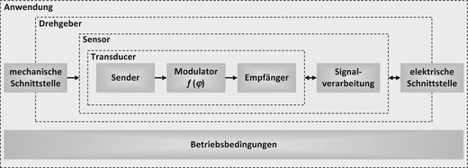

|

Diese abstrakte Betrachtungsweise hinsichtlich Sender-Modulator-Empfänger lässt sich mittels unterschiedlicher sensorischer Prinzipien umsetzen. In Drehgebern finden sich :navy:`optische, magnetische, induktive, kapazitive und resistiv-potenziometrische Sensorkerne`.

Weiterhin kann man nach :navy:`elektromechanischen` und :navy:`mechatronischen` Drehgebern unterscheiden. Bei elektromechanischen Drehgebern sind keine halbleitenden Elemente verbaut, wohl aber bei den mechatronischen. Bei den elektromechanischen Drehgebern stellt der Drehgeber nur den :navy:`Transducer` (dt.: Wandler) dar. Die auswertende Einheit steuert Sender und Empfänger und führt alle Maßnahmen zur Winkelauswertung durch. Bei einem mechatronischen Drehgeber hingegen geschieht dies alles geräteintern. Die aufbereitete Winkelinformation kann mit geringem Aufwand durch die auswertende Einheit verwendet werden.

|
|
|

Winkel, Drehzahl und Winkelbeschleunigung
-----------------------------------------

Die Aufgabe von Drehgebern besteht darin die :navy:`Winkelstellung` einer rotatorischen Achse zu einem Referenzpunkt zu messen und anzuzeigen. Dabei wird nicht nur die eigentliche Winkelmessung betrachtet, sondern auch die Erfassung abgeleiteter Größen wie die Drehzahl und die Winkelbeschleunigung.

|

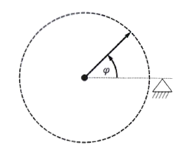

|

Winkel
^^^^^^

Für Winkel verwendet man die Einheiten :navy:`Grad` und :navy:`Radiant`. Dabei hat eine Umdrehung bekanntermaßen 360 Grad (Einheitszeichen °) oder im Bogenmaß, 2 :math:`\pi` Radiant (Einheitszeichen rad). Die beiden Einheiten lassen sich mit dem Umrechnungsfaktor :math:`\rho` einfach in Beziehung setzen:

:math:`\quad \rho = \frac{360°}{2\pi} = \frac{180°}{\pi}`

Ein Grad lässt sich unterteilen in :navy:`Bogen- bzw. Winkelminuten` (1° = 60') oder gar :navy:`Bogen- bzw- Winkelsekunden` (1' = 60''). Manchmal werden auch Milli-Grad (m°; :math:`10^{-3}` °) verwendet. Eine Umdrehung (ein Vollwinkel) hat somit:

1 Umdrehung :math:`\; \widehat{=}` 360° = 21.600' = 1.296.000'' = 360.000m°

Entsprechend ist eine Winkelsekunde annähernd der 1,3 Millionste Teil einer Umdrehung.

|

Winkelgeschwindigkeit
^^^^^^^^^^^^^^^^^^^^^

Neben dem eigentlichen Winkel sind auch daraus ableitbare Größen, wie z.B. die Winkelgeschwindigkeit bzw. :navy:`Drehzahl` für viele Anwendungen relevant.

Die Winkelgeschwindigkeit :math:`\omega` bezeichnet die Änderung des Winkels mit der Zeit:

:math:`\quad \omega = \frac{d\varphi}{dt}`

bzw. bei gleichförmiger Bewegung

:math:`\quad \omega = \frac{\Delta\varphi}{\Delta t}`

Als Einheit für die Winkelgeschwindigkeit verwendet man *rad/s*, seltener *°/s*. In der Technik bezieht man sich oft auf die Anzahl der Umdrehungen pro Zeiteinheit, d.h. die Drehzahl (oder Umdrehungsfrequenz). Hierfür verwendet man die Einheit :navy:`Umdrehungen pro Minute` (*rpm*), 1/min oder :math:`{min}^{-1}` . Formal hat die Winkelgeschwindigkeit und die Drehzahl folgende Beziehung:

:math:`\quad n = \frac{30}{\pi} \cdot \omega = \frac{30}{\pi} \cdot \frac{\Delta\varphi}{\Delta t}`

|

Winkelbeschleunigung
^^^^^^^^^^^^^^^^^^^^

Die Winkelbeschleunigung :math:`\alpha` beschreibt die Änderung  der Winkelgeschwindigkeit :math:`\omega \;` mit der Zeit. Mathematisch ausgedrückt ergibt sich:

:math:`\quad  \alpha = \frac{d\omega}{dt} = \frac{d²\varphi}{dt²}`

oder bei gleichförmiger Geschwindigkeitsänderung:

:math:`\quad  \alpha = \frac{\Delta\omega}{\Delta t} = \frac{\Delta² \varphi}{\Delta t²}`

Bezogen auf die Drehzahl ergibt sich die folgende Beziehung:

:math:`\quad  \alpha = \frac{\pi}{30} \cdot \frac{\Delta n}{\Delta t}`

Als Einheiten verwendet man *rad/s²*.

.. raw:: html

   &nbsp; 
   &nbsp; 
   &nbsp; 
   &nbsp;

Messbereich
-----------

Bei Drehgebern unterscheidet man primär drei Messbereiche: Teilwinkel, Vollwinkel oder mehrere Umdrehungen. 

Stehen bei Drehgebern 

.. raw:: html
	
    &nbsp;&nbsp;&nbsp;&nbsp;&nbsp;&nbsp; &bull; &nbsp;  eindeutige Winkelwerte über <u>eine mechanische Umdrehung</u> zur Verfügung, spricht man von <b>Singleturn-Drehgebern</b> 
	&nbsp;&nbsp;&nbsp;&nbsp;&nbsp;&nbsp; &bull; &nbsp;  eindeutige Winkelwerte über <u>mehrere Umdrehungen</u> zur Verfügung, spricht man von <b>Multiturn-Drehgebern</b> 

|

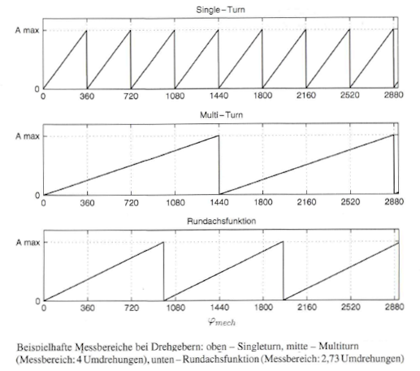

|

:under:`Daneben gibt es zwei Sonderfälle zu betrachten:`

:navy:`Inkrementalgeber` zeigen nur eine Winkeländerung (Inkremente) gemäß deren Auflösung an. Diese Funktion steht über eine Umdrehung zur Verfügung.

:navy:`Rundachsfunktion` (Endloswelle, elektronisches Getriebe) - Drehgeber zeigen einen anderen Messbereich an als den, der der verwendeten Sensorik zugrunde liegt. Die Rundachsfunktion erlaubt ganzzahlige und nicht-ganzzahlige Über-und Untersetzungsverhältnisse (s.Bild oben).

.. raw:: html

   &nbsp; 
   &nbsp; 
   &nbsp; 
   &nbsp;
   
Winkelberechnung
----------------

Nur wenige Drehgeber erlauben es, einen winkelproportionalen Wert direkt sensorisch zu ermitteln (z.B. resistiv-potentiometrischer Drehgeber). Bei den anderen Prinzipien wird versucht einen in der Mathematik üblichen Weg zu gehen: :navy:`Der Winkel wird auf Basis trigonometrischer Funktionen ermittelt`. Die Sensoren werden so gestaltet, dass bei Drehbewegung sinusförmige Signale entstehen, meist ein :navy:`Sinus- und ein Cosinussignal` (s. Bild unten). Diese Signalpaarung wird auch als Quadratursignale bezeichnet, da sie in Quadratur, d.h. im rechten Winkel stehen (90° Phasenversatz). 

Zur Veranschaulichung kann eine Darstellung am Einheitskreis verwendet werden. Ein Zeiger (Vektor) mit der Länge 1 dreht sich gegen den Uhrzeigersinn. Als Drehachse ist der Koordinatenursprung definiert und als Nullpunkt die Lage des Zeigers auf der Abszisse in positiver Richtung liegend. Die :navy:`y-Komponente des Zeigers repräsentiert den Sinus` und die :navy:`x-Komponente den Cosinus.` Der Winkel :math:`\varphi\;` wird zwischen dem Vektor und der Abszisse aufgespannt.

|

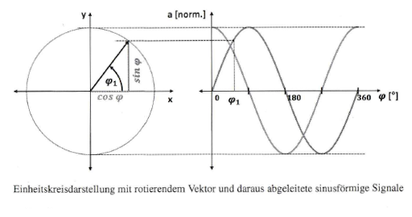

|

Diese Sinus- und Cosinussignale lassen sich anhand der bekannten trigonometrischen Beziehung

:math:`\quad \tan\varphi = \frac{\sin\varphi}{\cos\varphi}`

wie folgt in einen Winkel umrechnen:

:math:`\quad \varphi = \arctan(\frac{a_{sin}}{a_{cos}})`

( :math:`\varphi` : Errechneter Winkel in [°]; |nbsp| |nbsp| :math:`a_{sin}, a_{cos}` : Momentanwerte der Sinus- und Cosinussignale)

Die Gleichung bezieht sich auf eine Sinus-Cosinus-Signalperiode. Hat ein Drehgeber eine solche Signalperiode pro Umdrehung, so ergibt sich direkt die Winkelstellung des Rotors zum Stator. Da in der praktischen Umsetzung die Sinus- und Cosinussignale und somit der sich ergebende Winkel nicht unendlich hoch aufgelöst werden können, Anwendungen aber hohe Auflösungen fordern, :navy:`unterteilt man den Vollwinkel in mehrere Teilwinkel`. Dabei wird jeder Teilwinkel durch eine Signalperiode repräsentiert, man rechnet also mit mehreren Perioden pro Umdrehung (engl.: „periods per revolution", PPR). Dies wird dargestellt durch:

:math:`\quad \varphi_i = \frac{1}{\text{PPR}} \arctan\frac{a_{sin}}{a_{cos}} \quad\quad\quad\quad\quad (1.1)`

( :math:`\varphi_i` : Momentanwert des Winkels der i-ten Periode in [°]; |nbsp| |nbsp| PPR: Anzahl der Periode pro Umdrehung; :math:`\; a_{sin}, a_{cos}` : Momentanwerte der Sinus- und Cosinussignale)

Durch diese Beziehung kann man zwar die Auflösung erhöhen, verliert aber die Aussage über einen absoluten Winkel auf eine Umdrehung. Es ist daher nun sinnvoll :math:`\varphi_{elektr}` und :math:`\varphi_{mech}` einzuführen. :math:`\varphi_{elektr}` bezeichnet :navy:`einen Winkel innerhalb einer elektrischen Periode` und :math:`\varphi_{mech}` jenen auf :navy:`eine mechanische Umdrehung`.

|

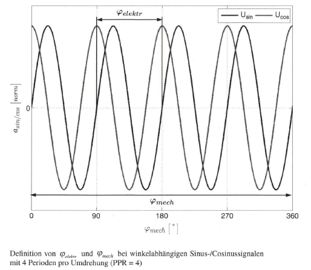

|

Neben der reinen Winkelrechnung kann auf Basis der sinusförmigen Signale auch eine einfache :navy:`Überprüfung der Funktion des Drehgebers` durchgeführt werden. Geben Drehgeber direkt sinusförmige Signale an der elektrischen Schnittstelle aus, kann die bekannte goniometrische Beziehung :math:`\sin²+\cos² = 1` interpretiert werden als:

:math:`\quad a^2_{sin} + a^2_{cos} = \text{const}`

Das Ergebnis wird auch als Vektorlänge bezeichnet. Diese ist in vielen Belangen von hoher Bedeutung. 

Eine weitere Möglichkeit, die sich durch die Verwendung von Sinus- und Cosinussignalen ergibt ist die der Lissajous-Figur. Mit einem Oszilloskop in xy-Darstellung zeichnen die sinusförmigen Signale bei Drehung eine kreisähnliche Form (ein Kreis bei idealen Sinus-Cosinus-Signalen). Der Einheitskreis wird dadurch messtechnisch dargestellt. Auf diese Weise lassen sich verschiedene Qualitätsmerkmale der Quadratursignale abschätzen. Dies ist ein einfach umzusetzendes indikatives Verfahren.

Die eigentliche Winkelrechnung basiert auf Gl. 1.1 (s.oben) wird in diesem Zusammenhang als :navy:`Interpolation` bezeichnet. Interpolatoren können in zwei Dimensionen auf unterschiedliche Weise umgesetzt werden. Zum einen gibt es
verschiedene Verfahren und zum anderen verschiedene Integrationsstufen in der Umsetzung in Hardware und Software. :navy:`Sinus/Cosinus-Digital-Wandler` (engl.:„sine/cosine-to-digital converter"; SDC), wie Interpolatoren auch genannt werden, gibt es als dedizierte ASIC- oder ASSP-Komponenten. Auch kann die Funktion nach Digitalisierung der sinusförmigen Signale durch geeignete Analog-Digital-Wandler mittels Software auf Mikrocontrollern, digitalen Signalprozessoren (DSPs) oder FPGAs implementiert werden. Dabei wird oft der sogenannte CORDIC Algorithmus (engl.: „coordinate rotation digital computer") für die Berechnung der trigonometrischen Funktionen eingesetzt. 

:under:`Bei den Verfahren sollen drei mögliche genannt werden:` 

:navy:`[1]` Der klassische Ansatz ist es :navy:`die Sinus- und Cosinus-Signale gleichzeitig mit linearen Analog-Digital-Wandlern abzutasten` und die digitalen Werte gemäß Gl. 1.1 in einen Winkel umzurechnen. Alternativ kann der Winkelwert aus einer zweidimensionalen Matrix ausgelesen werden, wobei die digitalen Sinus- und Cosinuswerte die Indizes für die Reihen und Spalten darstellen. Vor der Winkelwandlung können die Digitalwerte normiert (z. B. Amplitude) und hinsichtlich Fehlerkomponenten (z. B. Offset) korrigiert werden. 

:navy:`[2]` Ein :navy:`Flash-SDC` ist vergleichbar einem linearen Flash Analog-Digital-Wandler. Bei diesen wird das Eingangssignal mit mehreren Referenzspannungen durch analoge Komparatoren verglichen. Für jeden aufgelösten Schritt wird ein Komparator benötigt. Die Referenzspannungen werden aus einer Spannung durch eine Kaskade von Widerständen gebildet. Beim Flash-SDC werden im Gegensatz dazu zwei Eingangssignale zugeführt und die Widerstandskaskade ist so ausgelegt, dass die Komparatoren Winkelwerte zugeordnet werden. Flash-SDCs sind sehr schnell, der Hardwareaufwand lässt sich allerdings nur für geringe Auflösungen sinnvoll umsetzen. 

:navy:`[3]` Interpolatoren die mit dem :navy:`Nachlaufverfahren` arbeiten, schätzen einen Winkel aus den Signalen ab und führen das Ergebnis auf den Eingang zurück. Dort wird eine Differenz ermittelt, die solange nachgeregelt wird, bis der Fehler minimal wird. Diese Regelung geschieht sehr schnell, insbesondere wenn ein Winkel ermittelt wurde und dieser nur nachgeführt werden muss. 

Die verschiedenen Verfahren unterscheiden sich, u. a. im **Implementierungsaufwand** (Hard- und/oder Software), in der **Schnelligkeit** (somit durch Wandlung eingeführte Latenz), **Auflösung** und **Genauigkeit**.

.. raw:: html

   &nbsp; 
   &nbsp; 
   &nbsp; 
   &nbsp;
   
Kodierung
---------

Ein Sinus- Cosinus-Signalpaar wird dazu verwendet, einen Winkel innerhalb einer elektrischen Periode darzustellen. Dies ist für industrielle Anwendungen meist
nicht ausreichend. Es werden Konventionen und Zusatzinformationen zur Gewinnung der Absolutinformation eingeführt. Es ergeben sich Codes, die innerhalb des Drehgebers oder durch eine Steuerung weiter verarbeitet werden können. Dabei unterscheidet man :navy:`Inkrementalcodes`, die eine Winkeländerung anzeigen, von :navy:`Absolutcodes`, die zu jeder Zeit einen eindeutigen Winkel innerhalb des Messbereichs zur Verfügung stellen.

|

Inkrementalcode
^^^^^^^^^^^^^^^

Bei Drehgebern mit Inkrementalcode (Inkrement als Elementarschritt oder abzählbares Intervall) wird die Winkelinformation relativ ausgegeben. Das heißt, es wird nicht die absolute Winkelinformation, sondern nur eine :navy:`Winkeländerung` mittels Signaländerungen angezeigt. Es werden zwei Signalarten genutzt: rechteck- und sinusförmige Signale.

Bei den inkrementalen Drehgebem mit Rechtecksignalen wird in der einfachsten Form ein einziges Signal zur Verfügung gestellt (Bild unten, links). Dieses Signal
erlaubt nur die Ermittlung einer Winkeländerung anhand der Auswertung der Signalflanken. Erweitert man das System um ein zweites, um 90° phasenverschobenes Signal, erhält man ein Quadratursignalpaar. Die Signale dieses Paares werden mit unterschiedlichen Buchstabenkombinationen bezeichnet. Hier werden die Buchstaben *A* und *B* verwendet. Bezieht man sich auf die Signalpaarung, so kann die Bezeichnung *AqB* verwendet werden. Mit *AqB* kann man zusätzlich zur Winkeländerung die :navy:`Drehrichtung` erkennen (Bild unten, oben rechts). Hierzu werden zusätzlich zu den Signalflanken die Signalpegel ausgewertet. Gleichzeitig wird bei gleicher Anzahl an Impulsen pro Signal pro Umdrehung die Auflösung verdoppelt. Um die Zuordnung zu einem Bezugspunkt auf dem Vollwinkel zu erhalten, kann ein drittes Signal, zur Verfügung gestellt werden, der sogenannte Nullimpuls - hier Signal Z (Bild unten, oben rechts). Dieser Nullimpuls schaltet einmalig pro Umdrehung und hat eine definierte Lage und Dauer in Bezug auf die Inkrementalsignale A und B (eine eingeschränkte Anzahl von Relationen wird verwendet). Dadurch kann eine quasi-absolute Position ermittelt werden. Allerdings muss eine sogenannte Referenzfahrt beim Einschalten des Drehgebers durchgeführt werden, um diesen Bezugspunkt einmalig zu durchfahren. Durch Zählen der Inkrementalsignale kann eine pseudo-absolute Position (Single- oder gar Multiturn) nachgehalten werden.

|

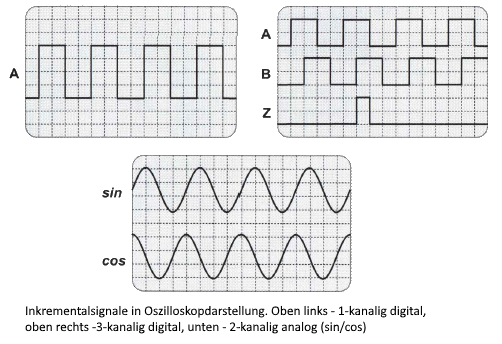

|

In der realen Umsetzung erhält man keine perfekten Rechtecksignale direkt aus der Sensorik. Meist erhält man verschliffene, dreieckförmige oder sinusförmige Signale. Für gut schaltende Rechtecksignale, werden diese anhand eines Komparators aufbereitet. Natürlich werden aber auch die sinusförmigen Signale in Inkrementaldrehgebern verwendet (Bild oben, unten). Da Steuerungen, die für Inkrementalgeber ausgelegt sind, rechteckförmige Signale erwarten, werden die Sinus-Cosinus-Signale aufbereitet. Dazu kann auch die Interpolation verwendet werden, wodurch auch die Auflösung erhöht wird.

Die Abbildung unten zeigt die Codescheibe eines optischen Inkrementalgebers. Die randnah gestrichelte Struktur besteht aus regelmäßigen, (Rechtecke polar aufgetragen) lichtdurchlässigen und -undurchlässigen Bereichen zur Generierung der AqB-Signale. Die rechteckförmige Struktur über der "500"-Kennzeichnung dient zur Generierung des Nullimpulses. 

|

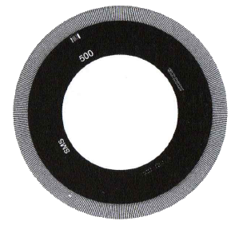

|

Ein Nebenaspekt hochauflösender optischer Drehgeber, in deren Ausprägung als Inkrementalgeber mit rechteckförmigen Signalen, ist, dass ihre Leistungsfähigkeit nur unwesentlich durch äußere Bedingungen, wie beispielsweise Temperatur, beeinflusst wird. Die hohe native Auflösung, die physikalisch in der Maßverkörperung vorliegt, reduziert erheblich den Einfluss von signalperiodenbezogenen Fehlern wie Offset- und/oder Amplitudenänderungen.

|

Absolutcode
^^^^^^^^^^^

Genügt es bei einer Anwendung nicht, dass nur Winkeländerungen oder Winkel innerhalb eines Teilwinkels (z. B. eine elektrische Periode) angezeigt werden, sondern zu jeder Zeit eine absolute Winkelposition auf eine Umdrehung (oder mehrere Umdrehungen) zur Verfügung steht, kommen :navy:`Absolutdrehgeber` zum Einsatz. Dies ist insbesondere dann wichtig, wenn die Absolutposition beim Einschalten des Drehgebers zur Verfügung stehen muss, da auf eine Referenzfahrt anwendungsbedingt verzichtet werden muss. Der Begriff Absolutposition bezieht sich eher auf eine lineare Position wird aber auch bei Drehgebern zur Angabe eines absoluten Winkels verwendet.

Absolutdrehgeber verwenden eine Kombination aus einer mehr oder weniger hoch aufgelösten Inkrementalspur und weiteren Signalspuren. Diese Zusatzinformation wird dazu genutzt den elektrischen Perioden der Inkrementalspur (sinus- oder rechteckförmig) einen Index zuzuweisen. Die Signale zusammen genommen realisieren einen Code, der von der Maßverkörperung getragen wird. Zum Einsatz kommen, z. B. Binär-, Gray-, Nonius- oder Pseudo-Random-Codes.

Der einfachste Code ist der :navy:`Binärcode`. Die Signale werden als Rechtecksignale gelesen, wobei jede Signalspur ein Bit eines binären Codes darstellt. Es werden zwei Arten von Code benutzt. Beim klassischen Binärcode stellt das gelesene Codewort direkt den Winkel dar (Bild unten, oben). Bei Drehgebern verwendet man allerdings
bevorzugt den :navy:`Gray-Code` (Bild unten, unten). Dies ist ein stetiger Code mit der spezifischen Eigenart, dass sich beim Übergang von einem auflösbaren Schritt zum nächsten, jeweils nur ein Bit ändert. Es entsteht kein „Winkelprellen" beim Übergang von einem Codewort zum nächsten. Ein möglicher Ablesefehler beträgt maximal eins.

|

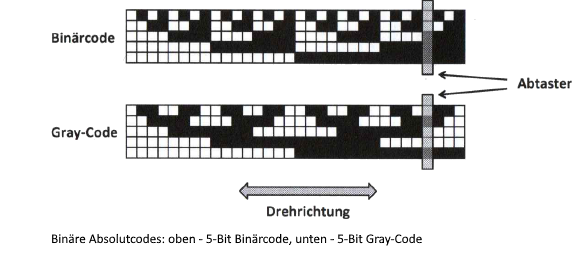

|

Der Nachteil der Binärcodes ist, dass jedes Datenbit in einer dedizierten Codespur codiert werden muss. Dies führt zu einem großen radialen Platzbedarf bei großen
Codebreiten. Des Weiteren kann es auch schwierig sein den Sensor zu gestalten. So muss bei optischen Drehgebern eine relativ große Fläche homogen ausgeleuchtet
werden. Für magnetische Drehgeber gar wäre es eine große Herausforderung eine entsprechende Codescheibe zu magnetisieren. Nonius- und Pseudo-Random-Codes begegnen diesem Problem, da sie mit weniger Codespuren zur Darstellung eines absoluten Drehgebercodes auskommen.

Der :navy:`Nonius-Code` (oder *Vernier* - Code) ist aus der Anwendung beim Messschieber bekannt. Bei diesem Code werden eine Hauptskala (hier bezeichnet mit *m*) und eine oder mehrere Teilskalen ( :math:`n_i` ) miteinander verrechnet. In der typischen Verwendung des Codes in Drehgebern haben die Spuren eine um eins unterschiedliche Anzahl von Perioden pro Umdrehung ( :math:`m = n+l` ). Bei der Wahl der Teilungsperioden muss auf das Auflösevermögen des Systems geachtet werden. Es können nicht beliebig große Teilungen verwendet werden, da diese irgendwann nicht mehr eindeutig erfasst und verrechnet werden können. Werden mehr als zwei Codespuren verwendet, lassen sich größere, oder höher aufgelöste Messbereiche realisieren. Die Gl. (1.2) stellt die Verrechnung eines zweispurigen Nonius-Codes dar (s.Bilder unten).

.. math::

	\varphi = \frac{1}{m - n} \, \left( \arctan \left( \frac{\sin{m\varphi}}{\cos{m\varphi}} \right) - \arctan \left( \frac{\sin{n\varphi}}{\cos{n\varphi}} \right) \right) \quad\quad\quad\quad  (1.2)  

|

Sonderformen des Nonius-Codes verwenden Skalen, deren Periodenlänge sich um mehr als eine Periode unterscheiden. Auch bei diesen Codes kann man den Absolutwinkel mit Gl. (1.2) berechnen. Zu beachten ist, dass die beiden Faktoren keinen gemeinsamen Teiler haben, da sonst die Eindeutigkeit auf eine Umdrehung verloren geht. Auch mit diesem als *MxN* bezeichneten Code kann ein recht großer Messbereich erfasst werden. Der MxN-Code wird bei Drehgebern eingesetzt, bei denen es sinnvoll ist, sehr unterschiedliche Periodenlängen in den Codespuren zu verwenden. Außerdem ist er weniger empfindlich auf mechanische Toleranzen (Bild unten).

|

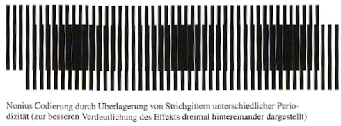

.. raw:: html

   &nbsp; 
   &nbsp; 
   &nbsp; 
   &nbsp;

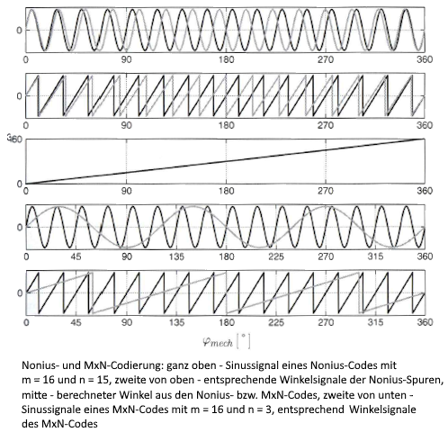

|

Der :navy:`Pseudo-Random-Code [3, 4]` ist ein einspuriger Absolut-Code, der ebenfalls parallel zu einer Inkrementalspur verwendet werden kann. Er ist so gestaltet, dass er sequentiell ausgelesen wird. Für einen :math:`2^x` -Code wird ein Abtaster mit mindestens x Ausleseelementen tangential zur Drehachse aufgebracht. Jeder Winkelschritt stellt ein eindeutiges Codewort dar, das mittels eines passenden Dekodierpolynoms dekodiert werden kann. Die Besonderheit bei diesem Code ist, dass er in sich geschlossen ist, d. h. das letzte Codewort geht nahtlos in das erste über, was für Drehgeber natürlich sehr günstig ist (Bild unten).

|

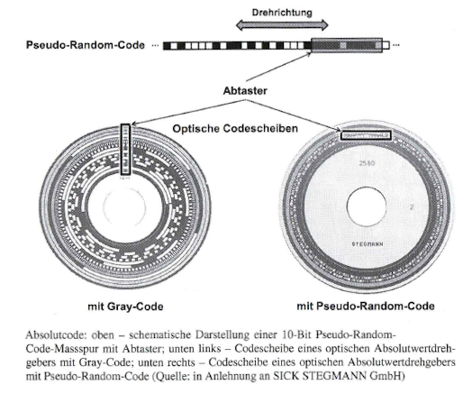

.. raw:: html

   &nbsp; 
   &nbsp; 
   &nbsp; 
   &nbsp;

Synchronisation
^^^^^^^^^^^^^^^

Immer dann, wenn ein Messwert aus mehreren Teilmessungen zusammengesetzt wird, ist es sinnvoll :navy:`die einzelnen Teilmesswerte zueinander zu synchronisieren`. Dies gilt insbesondere dann, wenn die Teilmessungen durch unterschiedliche, unabhängige Sensoren erfasst werden. Beispiele hierfür sind die Kombination einer Inkrementalspur mit einem Pseudo-Random-Code, die Übertragung eines Positionswerts über eine hybride Schnittstelle (niedrig aufgelöster Absolutwert auf einem digitalen Kanal und hochaufgelöste Information innerhalb einer Sinus-Cosinus-Periode als analoges Signal) oder bei der Kaskadierung mehrerer Multiturn-Stufen untereinander und mit einer Singleturn-lnformation. Problematisch ist, dass die Ergebnisse der Teilmessungen unterschiedliche Schaltzeiten aufweisen können. Dies kann bedingt sein durch Signallaufzeiten, Getriebespiel bei einem getriebebasierten Multiturn, Hysterese, Signalrauschen, etc.. Wenn keine Maßnahmen getroffen werden, kann die Stetigkeit der Gesamtinformation verloren gehen. Die Synchronisation beschreibt nun ein Verfahren mit dem diesem Phänomen begegnet werden kann.

Die Synchronisation wird bei digitalisierten Werten der Teilmessungen verwendet. Entsprechend lässt sich auch das Verfahren anhand von digitalen Codeworten am einfachsten beschreiben. In der Abbildung unten wird ein System beispielhaft angeführt, das seine Positionsinformation aus zwei Teilmessungen bildet. Dabei stellt die eine Teilmessung einen interpolierten Wert einer elektrischen Periode (Feinposition) dar und die zweite einen Absolutwert auf eine mechanische Umdrehung. Im oberen Teil schließen die Datenwörter der beiden Teilmessungen direkt aneinander an. :navy:`Schaltet nun der Absolutwert nicht in exakt dem Moment um in dem die Feinposition von einer Periode zur nächsten wechselt, so zeigt der Absolutwert einen falschen Periodenindex an, es kommt zu einem irregulären Positionssprung`. Dieser wird erst wieder aufgehoben, wenn der Absolutwert in die richtige Periode zeigt. Dieser Positionssprung kann dadurch behoben werden, dass die Absolutposition feiner aufgelöst wird, d.h. der Absolutwert repräsentiert nicht nur die Anzahl der Perioden, sondern trägt noch Information innerhalb einer Periode. In dem Beispiel in der Abbildung unten werden zwei Synchronisationsbits eingeführt. Diese werden so ausgelegt, dass sie die gleiche Wertigkeit haben wie die entsprechenden hochwertigen Bits der Feinposition. Bei der Inbetriebnahme eines Geräts werden diese so festgelegt, dass die überlappenden Bits den gleichen Wert haben. Unterschiede im Wechselverhalten können nun ausgeglichen werden. Weisen die Bits unterschiedliche Werte auf wird eine Differenz gebildet und das Datenwort des Absolutwerts so gesetzt, dass es in die Richtung der kleineren Differenz liegt. Je mehr Synchronisationsbits verwendet werden, desto sicherer funktioniert das Verfahren. Dies bringt aber einen größeren Umsetzungsaufwand mit sich.

|

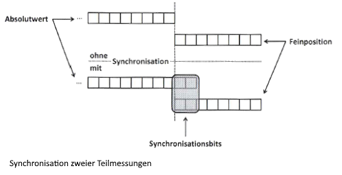

|

.. raw:: html

   &nbsp; 
   &nbsp; 
   &nbsp; 
   &nbsp;
   
Auflösung, Messwertabweichung, Reproduzierbarkeit
-------------------------------------------------

Wie für alle Messgeräte sind auch für Drehgeber deren 

.. raw:: html

	&nbsp;&nbsp;&nbsp;&nbsp;&nbsp;&nbsp; &bull; &nbsp; <b>Auflösung,</b> 
	&nbsp;&nbsp;&nbsp;&nbsp;&nbsp;&nbsp; &bull; &nbsp; <b>Messwertabweichung,</b> 
	&nbsp;&nbsp;&nbsp;&nbsp;&nbsp;&nbsp; &bull; &nbsp; <b>Wiederholgenauigkeit und</b> 
	&nbsp;&nbsp;&nbsp;&nbsp;&nbsp;&nbsp; &bull; &nbsp; <b>Reproduzierbarkeit</b> 

|

wichtige Kenndaten.

Unter :navy:`Auflösung` versteht man die Fähigkeit eines Messgerätes, unterschiedliche Werte innerhalb dessen Messbereichs zu unterscheiden. Bei rein analogen Systemen
ist die Auflösung theoretisch unendlich groß, wird aber in der Realität durch Signalrauschen begrenzt. In digitalisierten Systemen wird die Auflösung zusätzlich
durch das Auflösevermögen der verwendeten Analog-Digital-Wandler und (wenn auch heutzutage von untergeordneter Bedeutung) die Wortbreite der Recheneinheit sowie der verwendeten Algorithmen definiert. Bei Drehgebern bezieht sich die Auflösung auf den mechanischen Winkel. Es sind für den Anwender zwei Fälle zu unterscheiden: Drehgeber mit digitalen oder analogen Signalen.

Bei :under:`Inkrementaldrehgebern` mit rechteckförmigen Signalen definiert sich die Auflösung aus der Anzahl der Impulse über den Messbereich. Da Quadratursignale verwendet werden und die Impulswechsel erfasst werden können, hat der Drehgeber eine um den Faktor vier höhere Auflösung als Impulse pro Signal (Bild unten).

|

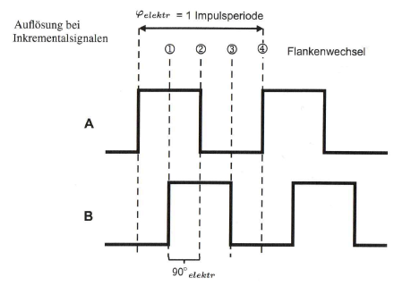

|

:under:`Absolute Drehgeber` mit rein digitaler Schnittstelle geben deren Auflösung direkt im Datenblatt an. Für die Sicherstellung dieser Angabe ist ausschließlich der
Gerätehersteller verantwortlich. Bei der Betrachtung der Auflösung bei Drehgebern mit analoger Schnittstelle sind neben den eingangs genannten Parametern weitere
Einflussfaktoren zu beachten. Näher betrachtet werden die Drehgeber mit sinusförmigen Ausgangssignalen. Bei diesen werden die Signale durch Analog-Digital-Wandler oder Interpolatoren digitalisiert und in einen Winkel umgerechnet. Dies hat zusätzlichen Einfluss auf das Drehgebersystem. Wie, soll an dem Beispiel in der Abbildung unten gezeigt werden, das auf der Arkustangens-lnterpolation mittels linearem ADC gemäß Gl. 1.1 basiert und eine Sinus-Cosinus-Periode betrachtet.

|

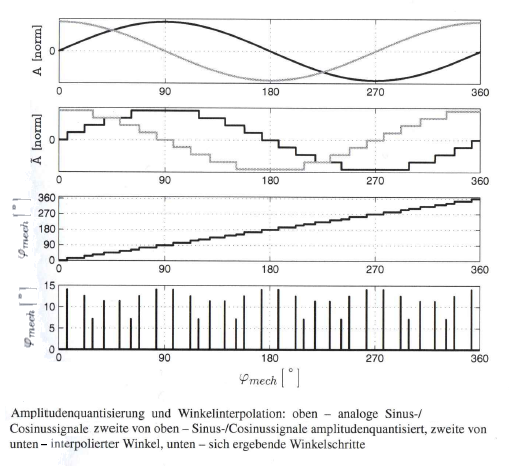

|

Es ist zu erkennen, dass der aus quantisierten Signalen abgeleitete diskrete Winkel keine gleichförmige Winkelauflösung innerhalb einer Sinus-Cosinus-Periode hat. Näherungsweise kann die Auflösung mit sinusförmigen Signalen angenommen werden:

.. math::

	\delta_{min} \approx \frac{360°}{\pi\cdot\text{PPR}\cdot\delta_{ADC}}
	
.. math::

	\bar{\delta} \cong \frac{360°}{4\cdot\text{PPR}\cdot\delta_{ADC}} 

(:math:`\delta_{min}` , :math:`\;\bar{\delta}\;`: kleinste und mittlere Winkelauflösung in Grad; :math:`\;\delta_{ADC}\;` : Auflösung der Analog-Digital-Wandler in Inkrementen)

Dabei gilt, dass die Auflösung der AD-Wandler für die Sinus- und Cosinus-Signale gleich ist.

In Anwendungen in denen eine Winkeländerung zur Erfassung der Drehzahl verwendet wird, hat die Winkelauflösung direkten Einfluss auf das Auflösevermögen der Drehzahl.
Wie bereits erläutert, errechnet sich die Drehzahl aus der Differenzierung des Winkels nach der Zeit, bzw. in der Praxis aus der Wnkeländerung innerhalb eines
Abtastintervalls. Für die Drehzahlauflösung ergibt sich somit folgende Beziehung:

.. math::

	\delta_{n} = \frac{60}{T\cdot\delta} = \frac{60\cdot\text{f}}{\delta}

(:math:`\delta_{n}\;` : Drehzahlauflösung in 1/min; T: Abtastintervall in Sekunden; f: Abtastfrequenz in Hertz; :math:`\;\delta\;`: Auflösung des Drehgebers in Schritten pro Umdrehung)

In der Antriebstechnik ist das Ziel eine möglichst hohe Drehzahlauflösung zu erhalten. Gemäß der obigen Gleichung erfordert dies ein möglichst großes Abtastintervall (meist nicht sehr flexibel wählbar und durch weitere Faktoren hin zu kleineren Werten erforderlich) oder/und eine möglichst hohe Drehgeberauflösung (Bild unten).

|

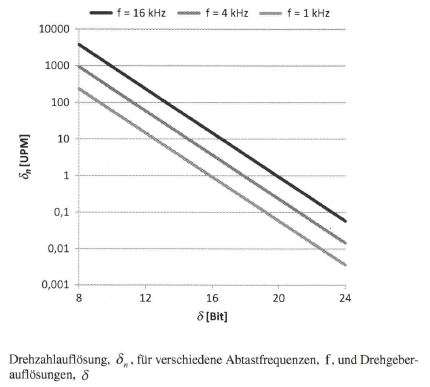

|

.. raw:: html

   &nbsp; 
   &nbsp; 
   &nbsp; 
   &nbsp;

Jedes Messgerät zeigt :navy:`Messwertabweichungen` (vergleichbare Begriffe: Ungenauigkeit, Nichtlinearität, Fehlergrenze, Messschrittabweichung). Diese gibt den Grad der Abweichung des angezeigten Werts von einem wahren Wert an. Sie wird verursacht durch zufällige und systematische Fehler. Die Fehlerarten und vor allem die Auswirkungen der Messwertabweichung sind dabei gerätespezifisch.

Der unabhängige Linearitätswert :math:`\epsilon` gibt die maximale Abweichung von der Geraden, entweder als Absolutwert oder relativ auf den Messbereich bezogen an:

.. math::

	\epsilon = \varphi_{\text{Ist}} - \varphi_{\text{Soll}}
	
.. math::

	\epsilon_{\text{rel.}} = \frac{\varphi_{\text{Ist}} - \varphi_{\text{Soll}}}{\text{Messbereich}}

(:math:`\epsilon\;` : absoluter Winkelfehler in[°]; :math:`\;\epsilon_{\text{rel.}}\;` : relativer Winkelfehler in [°]; :math:`\;\varphi_{\text{Ist}}\;` : gemessener Winkel in [°];  :math:`\;\varphi_{\text{Soll}}\;` : realer Winkel in [°])

Typischerweise wird der relative Winkel in Prozent angegeben. Es gibt aber auch Quellen, die den Fehler, oder in dem Fall dann die Genauigkeit in Bit angeben:

.. math::

	\epsilon_{\text{Bit}} = \log_{2} \frac{\text{Messbereich}}{\varphi_{\text{Ist}} - \varphi_{\text{Soll}}}

|

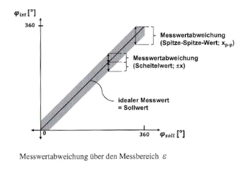

|

Unabhängig von der Darstellung muss immer darauf geachtet werden, ob die Fehlerangabe sich auf den Scheitelwert des Fehlers bezieht, oder auf den Spitze-Spitze-Wert (Bild oben). Die Abbildung unten reflektiert die Parameter Auflösung und Genauigkeit in Bezug auf den Einheitskreis. Die Breite des grau hinterlegten Bereichs bezieht sich dabei auf die Messwertabweichung und somit auf die Genauigkeit. Die Dichte der Punkte entlang des Einheitskreises bezeichnet die Auflösung.

|

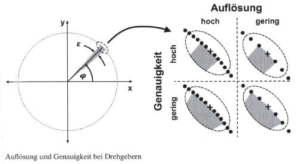

|

Die Messwertabweichung der Drehzahl definiert sich auch aus der Genauigkeit der Winkelposition sowie der Genauigkeit des Zeitintervalls. Auch wenn die zeitliche Abweichung meist in „ppm" (engl.: „parts per million", dt.: Teile von einer Million) angegeben wird, ist diese nicht zu vernachlässigen, denn schließlich liegen die drehzahlrelevanten Genauigkeitskomponenten von Drehgebern im Bereich von Winkelsekunden und somit auch im ppm-Bereich. 1m allgemeinen Sinne wird darauf an dieser Stelle nicht eingegangen.

.. raw:: html

   &nbsp; 
   &nbsp; 
   &nbsp; 
   &nbsp;

Unter :navy:`Wiederholgenauigkeit` versteht man die Fähigkeit eines Systems unter gleichen Bedingungen das gleiche zu tun. Auf ein Messgerät bezogen, beschreibt
dies die Streuung des Ist-Messwerts die sich ergibt, wenn ein bestimmter Sollwert unter gleichen Bedingungen mehrfach angefahren wird. Bei Drehgebern zählen hierbei zu den Rahmenbedingungen neben den Umwelteinflüssen (z. B. Temperatur, relative Feuchte) auch anwendungsrelevante Parameter, wie Drehrichtung und Drehzahl. Die Reproduzierbarkeit beschreibt die Abweichung im Ist-Wert die sich ergibt, wenn ein bestimmter Sollwert unter den erlaubten Betriebsbedingungen angefahren wird. Somit sind Umwelteinflüsse, anwendungsspezifische Parameter sowie sensorische Einllüsse (z. B. Hysterese) mit berücksichtigt. Für Wiederholgenauigkeit und :navy:`Reproduzierbarkeit` werden für gewöhnlich die Standardabweichung oder ein Vielfaches davon als Zahlenwert angegeben. Aus Datenblättern geht die Natur des Werts leider nicht immer eindeutig hervor, so dass man selten weiß, ob die maximale Abweichung oder eine statistische Abweichung durch die Angabe verstanden wird.

Wiederholgenauigkeit und Reproduzierbarkeit der Drehzahl ergeben sich auch aus den Kennwerten der Winkelposition, werden aber noch beeinflusst durch mögliche Schwankungen des Abtastintervalls. Auf die Auflösung, Genauigkeit, Wiederholgenauigkeit und Reproduzierbarkeit der Beschleunigung soll an dieser Stelle nicht eingegangen werden, da sie in der Praxis von untergeordneter Bedeutung ist.