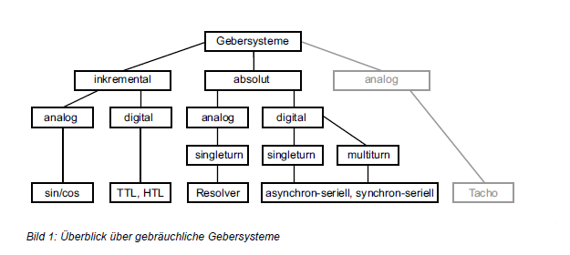
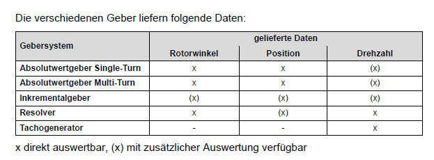
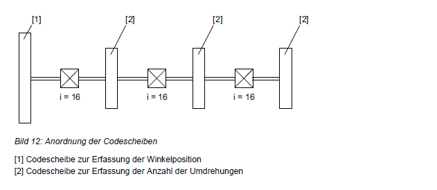
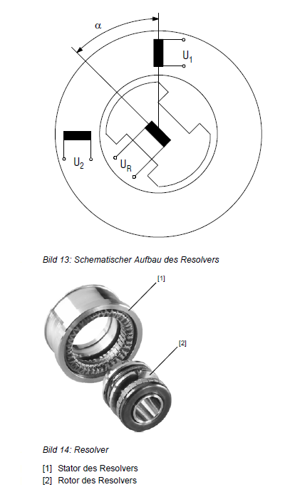
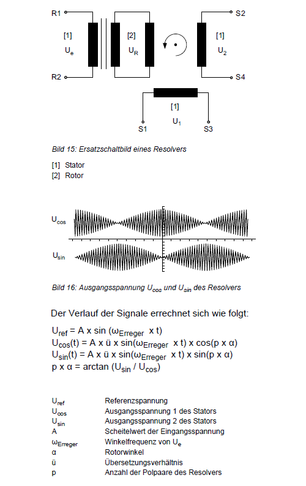
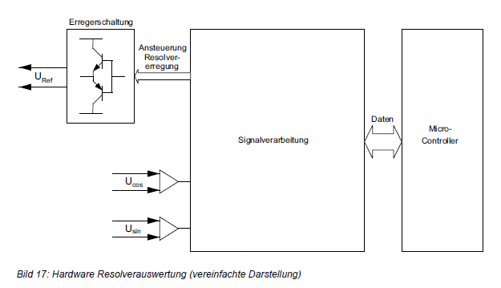

.. include:: <isonum.txt>
.. include:: <isogrk1.txt>

Drehgeber - Allgemeine Infos
============================

.. raw:: html

   (Verschiedene Quellen: Bücher, Dissertationen und Artikel)

------------

Welche Aufgaben haben Gebersysteme?
-----------------------------------

Gebersysteme an Antriebssystemen haben je nach Anforderung unterschiedliche Aufgaben zu erfüllen:

- Eine der häufigsten Aufgaben eines Gebersystems ist es, eine **Positionierung des Antriebssystems** zu ermöglichen. Diese Positionierung kann sowohl inkrementell als auch absolut sein. Hierbei kann der Geber am Motor oder an der Strecke angebaut sein.
- Des Weiteren können Gebersysteme für die **Drehzahlregelung** eingesetzt werden. Durch ein direktes Motorfeedback lassen sich Drehzahlgüte und Regelverhalten, auch bei großen Laständerungen, entscheidend verbessern. 
- Bei Synchronmotoren ist für die **dynamische Regelung bei unterschiedlichsten Lastbedingungen** die Rückmeldung der Rotorposition für das Stellen des Drehfeldes notwendig.

Mit der Auswahl des richtigen Gebers und der optimalen Kombination der Signale für Regelprozesse und Positionierung kann ein optimales Antriebssystem erstellt werden.

|

|

|

Inkrementalgeber
----------------

Optisches System
^^^^^^^^^^^^^^^^
Inkrementelle Drehgeber wandeln die Drehzahl in eine diskrete Anzahl von elektrische Impulsen um.
Dies erfolgt mit einer Codescheibe mit radialen, lichtdurchlässigen Schlitzen, die optoelektronisch abgetastet wird.
Dabei wird die Auflösung durch die Anzahl der Schlitze festgelegt.

|

Magnetische Systeme
^^^^^^^^^^^^^^^^^^^
Sensoren tasten rotierende Magnete oder ferromagnetische Maßverkörperungen ab und erzeugen daraus ein Signal. 
Diese Systeme sind in der Regel robuster als optische Systeme. Es kann auch von der klassischen Form abgewichen werden,
z. B. sind bei einem DR-Einbaugeber Magnete im Lüfterrad eingelassen. Diese Magnete werden von
Magnetfeldsensoren auf einem Gebermodul erfasst, welches am Stehbolzen befestigt ist.
Durch Interpretation der Messwerte werden entsprechende inkremetelle Signale erzeugt.

|

Signalpegel
^^^^^^^^^^^
Bei den inkrementellen digitalen Gebern werden 2 Signalpegel unterschieden:

**TTL (Transistor-Transistor-Logik)**

Die Signalpegel betragen U_low <= 0,5 V und U_high >= 2,5 V. Vom Sender zum Empfänger wird jeweils ein positives und ein negatives Signal (z. B. A, A_inv) übertragen und differenziell ausgewertet.
Durch diese symmetrische und differenzielle Auswertung können Gleichtaktstörungen minimiert und höhere Datenraten erzielt werden.

**HTL (Hochvolt-Transistor-Logik)**

Die Signalpegel betragen U_low <= 3 V und U_high >= U_B-3,5 V (U_B = 24V). Die Signale werden symmetrisch übertragen und differenziell ausgewertet.
Aufgrund dessen und wegen des hohen Spannungspegels haben HTL-Geber ein sehr gutes EMV-Verhalten.

|

Zusätzlich gibt es noch die analoge Ausgabe:

**sin/cos**

Sin-/Cos-Signale werden üblicherweise einer Gleichspannung von 2,5 V überlagert. Da die Sin-/Cos-Signale symmetrisch übertragen und differenziell ausgewertet werden (U_ss = 1 V), 
sind sie unempfindlich gegen asymmetrische Störungen und haben ein gutes EMV-Verhalten.

|

Absolutwertgeber
----------------

Absolutwertgeber mit asynchron-serieller-Schnittstelle
^^^^^^^^^^^^^^^^^^^^^^^^^^^^^^^^^^^^^^^^^^^^^^^^^^^^^^

In den letzten Jahren haben sich auch sogenannte Kombigeber am Markt etabliert. Solche Geber sind die Sin-Cos-Geber mit Absolutwert-lnformation.
Diese liefern neben der aktuellen Drehzahl des Motors auch Absolutwert-lnformationen und bieten somit technische und finanzielle Vorteile, wenn ein Absolutwertgeber erforderlich ist.

Der Absolutwertgeber mit einer asynchronen Schnittstelle ist ein typischer Kombigeber. Neben einem Sin-/Cos-Signal für die Drehzahlerfassung und einer Absolutwertinformation 
besitzt dieser Geber auch ein elektronisches Typenschild, in dem unter anderem Antriebsdaten abgelegt werden können. Dies erleichtert die Inbetriebnahme und reduziert mögliche
Eingabefehler des Anwenders, da dieser keine Antriebsdaten eingeben muss.

Absolutwertgeber mit asynchroner Schnittstelle gibt es als:

1. Anbaugeber für Asynchronmotoren und Synchrone Servomotoren
2. Einbaugeber für Synchrone Servomotoren

Beides gibt es in Single-Turn-Ausführung und in Multi-Turn-Ausführung.

Zu Beginn des Einschaltvorgangs erfasst die Baugruppe des Absolutwertgebers die absolute Lage. Daraus kann der Umrichter für Synchronmotoren die Kommutierungsinformation errechnen.
Der Umrichter liest diese Lageinformation über eine RS-485-Verbindung (Parameterkanal) aus und setzt einen Zählerstand. Ausgehend von diesem absoluten Wert werden die 
Positionsänderungen über die Spuren des Sin-/Cos-Gebers erfasst und analog über den Prozessdatenkanal an den Umrichter übertragen. Weitere Abfragen der Absolutposition
erfolgen dann nur noch zyklisch zur Plausibilitätskontrolle.

Ein Umrichter mit asynchron-serieller Schnittstelle erhält über den Parameterkanal sowohl die Lageinformation als auch den Zeitpunkt, für den diese Position gilt. Parallel
dazu werden ständig die einlaufenden Analogsignale (Sin-/Cos-Signale) auf dem Prozessdatenkanal empfangen und gezählt.
Der Geber ist wahlweise als Single- Oder Multi-Tum-Variante ausgeführt. Single-Turn bedeutet, dass die Information der Absolutposition sich immer nur auf eine Umdrehung
bezieht. Die Multi-Turn-Variante des Gebers kann über nachgeschaltete, untersetzte Codescheiben bzw- mittels eines elektronischen Umdrehungszählers zusätzlich noch
Auskunft über die Anzahl der Umdrehungen (typisch z. B. 4096) geben. Je nach Umrichter erfolgt somit z. B. nach der maximalen Anzahl der der Geber-Umdrehungen
ein Geberüberlauf, der jedoch im Non-Volatile-SRAM (NVS) des Umrichters mitgezählt wird. Bis zu 256 Geberüberläufe werden gespeichert (bei 4096 Umdrehungen). Wenn
die Spannung an den Versorgungs-Pins unter einen Grenzwert abfällt (z. B. bei Netzausfall), so erkennt dies der NVSRAM und die Daten werden nullspannungssicher gespeichert.

Überlauf-Beispiel:
Im Moment des Wiedereinschaltens gibt der EEPROM im Umrichter folgendes aus:

- Den absoluten Wert innerhalb eines Überlaufs (typisch 4096 x 4096)
- Die Anzahl der Überläufe (O — 255)

Wird nach Wegnahme der Versorgungsspannung der Antrieb, der sich kurz vor einem Überlauf befindet, über den Geberüberlaufpunkt verschoben, besteht beim Wiedereinschalten 
eine Diskrepanz zwischen den erfassten und den abgelegten absoluten Werten. Die Geberelektronik korrigiert daraufhin automatisch die gespeicherten mit den erfassten Werten.
Die Geberüberläufe werden im Umrichter mitgezählt, wodurch die absolute Position bestimmt werden kann.
Der Anwender bekommt die eigentlichen Geberüberläufe nicht zu sehen, diese werden im Umrichter gespeichert. Somit ist der Geber mit asynchon-serieller-Schnittstelle ein
echter Absolutwertgeber.

|

Absolutwertgeber mit SSI (synchron-serielles-Interface)
^^^^^^^^^^^^^^^^^^^^^^^^^^^^^^^^^^^^^^^^^^^^^^^^^^^^^^^

Die Absolutwert-lnformation wird durch eine Codescheibe z.B. mit Gray Code erzeugt, die in der Regel optisch abgetastet wird. Dabei ist jeder Winkelposition ein eindeutiges
Code-Muster zugeordnet. Somit kann die absolute Position der Motorwelle bestimmt werden. Die Besonderheit bei einem einschrittigen Gray Code im Gegensatz zum Binärcode ist,
dass sich immer nur 1 Bit ändert und damit eine fehlerhafte Abtastung sofort erkannt wird.

Neben der Single-Turn-Ausführung gibt es auch Multi-Turn-Geber, bei denen die absolute Position über mehrere Umdrehungen bestimmt wird.
Zur Erfassung der Umdrehungen werden verschiedene technische Lösungen angeboten. Verbreitet sind Micro-Getriebestufen, die magnetisch oder optisch mittels
Codescheiben abgetastet werden. Die Multi-Turn-Einheit ist ebenfalls als speichernder elektronischer Zähler verfügbar.
Beim einem optischen Drehgeber sind die Codescheiben jeweils durch eine Getriebestufe mit der Untersetzung i = 16 voneinander entkoppelt. Bei 3 zusätzlichen
Codescheiben (üblicher Wert) können also 16 x 16 x 16 = 4096 Umdrehungen absolut aufgelöst werden.

|

|

Resolver
--------

Bei synchronen Servomotoren ist das am häufigsten Gebersystem der Resolver. Ein Resolver kann innerhalb einer Motorumdrehung die absolute Lage der
Motorwelle ermitteln. Aus dem Resolversignal wird die Drehzahl und die absolute Position je Umdrehung abgeleitet.
Der Resolver besteht aus 2 Funktionsbaugruppen, dem Stator und dem Rotor.

|

|

Der Umrichter liefert ein hochfrequentes Erregersignal mit konstanter Amplitude und konstanter Frequenz. Dieses hochfrequente Signal wird über den Stator auf den Rotor
des Resolvers übertragen. Durch die Drehung des Resolver-Rotors werden in der Statorwicklung des Drehtransformators rotorlageabhängige Spannungen induziert.

|

|

Abhängig von der Lage des Rotors ändern Sich die Amplituden der Spannungen U_sin und U_cos und werden über jeweils einen Differenzverstärker der Auswertung zugeführt.
Die Differenzverstärker filtern Störsignale (Gleichtaktstörungen) auf den potenzialfreien Spursignalen U_sin und U_cos aus.
Die aktuelle mechanische Lage kann aus den abgetasteten Spursignalen ermittelt werden
p x alpha = arctan(U_sin /U_cos)
Die nachstehende Grafik gibt einen Überblick über die prinzipielle Hardwarestruktur einer Resolverauswertung, die nach dem abtastenden Verfahren arbeitet.

|

|

Welche Geber verwendet man bei welchem Motor?
---------------------------------------------

Gebersysteme für asynchrone Drehstrom- oder Servomotoren
^^^^^^^^^^^^^^^^^^^^^^^^^^^^^^^^^^^^^^^^^^^^^^^^^^^^^^^^
Bei asynchronen Motoren werden Gebersysteme in der Regel aus 2 Gründen eingesetzt:

- Drehzahlregelung (Um eine hohe Drehzahlgüte zu erreichen und auf Laständerungen optimal reagieren können)
- Positionierung

Hierbei kommen in Regel folgende Geber zum Einsatz
**Inkrementalgeber mit geringer Auflösung**  

- können nur zur Positionierung und nicht zur Drehzahlregelung eingesetzt werden
- nur Einfachpositionierung (Eil- Schleichgang) möglich
- dadurch geringere Dynamik des Systems
- Referenzfahrt notwendig
	  
**Inkrementelle Drehgeber**  

- zur Drehzahlregelung
- zur Positionierung
- Referenzfahrt ist notwendig

**Absolutwertgeber**

- zur Positionierung
- keine Referenzfahrt notwendig
- wenn kein Echtzeitkanal (Kombigeber mit entweder Sin/Cos-, TTL-, HTL-Signal) vorhanden ist, wird ein zusätzliches Gebersystem zur Drehzahlregelung benötigt

|

Gebersysteme für synchrone Servomotoren
^^^^^^^^^^^^^^^^^^^^^^^^^^^^^^^^^^^^^^^

Für eine dynamische Regelung wird bei Synchronmotoren noch die Rotorlage für das Regelsystem benötigt. 
In der Regel kommen bei synchronen Servomotoren zwei Systeme zur Rotorlageerkennung zum Einsatz

**Resolver**

- zur Rotorlageerkennung
- zur Drehzahlregelung
- zur Positionierung
- Referenzfahrt notwendig

**Absolutwertgeber**

- zur Rotorlageerkennung
- Absolutwertgeber fur Servomotoren sind in der Regel Kombigeber mit einem Echtzeitkanal (Sin/Cos) für die Drehzahlregelung
- zur Positionierung
- Bei Single-Turn-Gebern ist in der Regel eine Referenzfahrt notwendig
- bei Multi-Tum-Gebem ist keine Referenzfahlt notwendig

|

Gebersysteme für lineare Servosysteme
^^^^^^^^^^^^^^^^^^^^^^^^^^^^^^^^^^^^^

**Messlineale**

- zur Positionierung
- mit Absolutwertinformation auf dem Maßband ist keine Referenzfahrt notwendig bei rein inkrementeller Information auf dem Maßband ist eine Referenzfahrt notwendig

|

Welche Gebersysteme setzt SEW-EURODRIVE ein ?
---------------------------------------------

Inkrementalgeber mit geringer Auflösung
^^^^^^^^^^^^^^^^^^^^^^^^^^^^^^^^^^^^^^^
Mit den Inkrementalgebern mit geringer Auflösung kann man einfache nichtdynamische Positionierungen realisieren. Des Weiteren kann einfach und preisgünstig übewacht
werden, ob sich der Motor dreht. Wenn ein Zweispur-Geber verwendet wird, kann zusätzlich die Drehrichtung des Motors ermittelt werden.

|

Inkrementalgeber
^^^^^^^^^^^^^^^^
Inkrementalgeber eignen sich zur Drehzahlregelung und Positionierung. Sie haben 2 Signalspuren und eine Nullimpulsspur. Die Inkrementalgeber sind als Hohlwellengeber,
Spreizwellengeber, Steckwelle mit Endgewinde Oder Vollwellengeber mit Kupplung ausgeführt. Signalausgang: TTL, HTL Oder Sin/Cos.

|

Single-Turn-Kombigeber
^^^^^^^^^^^^^^^^^^^^^^
Die Absolutwertgeber sind zumeist Kombigeber. Sie beinhalten einen Single-Turn-Absolutwertgeber und einen hochauflösenden Sinusgeber. 
Für die Datenübertragung der Absolutwerte steht eine asynchron-serielle-Schnittstelle zur Verfügung. Sie eignen Sich für den Betrieb von Synchronmotoren.
Hierbei können sie zur Drehzahlregelung oder zur Positionierung über eine Umdrehung eingesetzt werden.

|

Absolutwengeber
^^^^^^^^^^^^^^^
Die Absolutwertgeber sind zumeist Kombigeber. Sie beinhalten einen Multi-Turn-Absolutwertgeber und einen hochauflösenden Sinusgeber.
Für die Datenübertragung der Absolutwerte stehen wahlweise eine SSI-Schnittstelle und eine asynchron-serielle- Schnittstelle zur Verfügung.

|

------------

|
