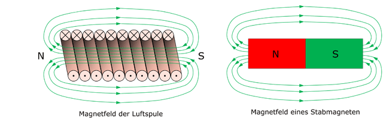
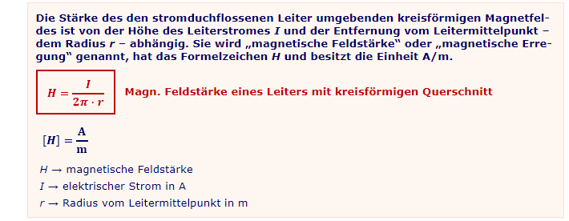
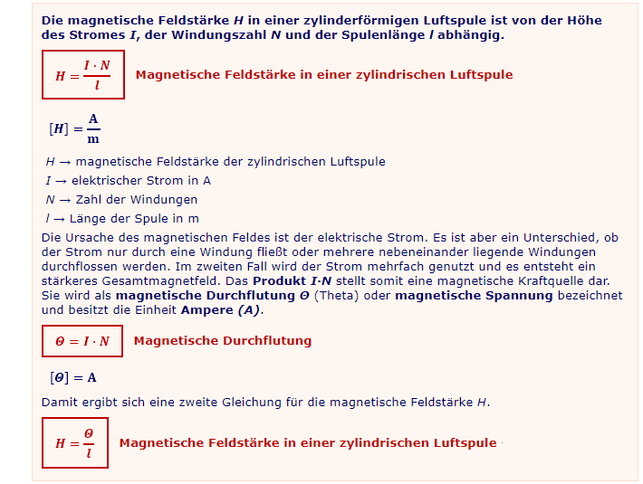
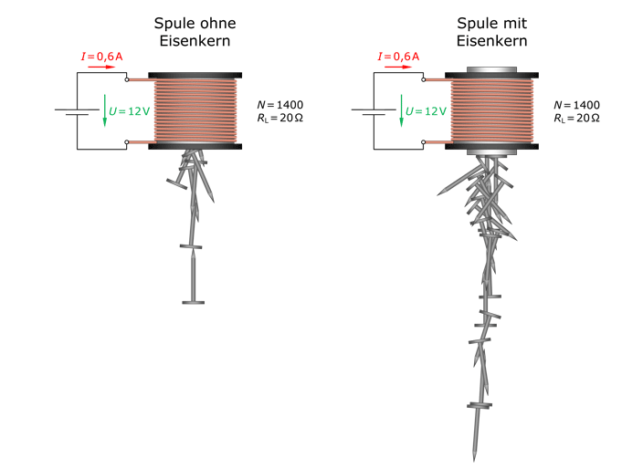
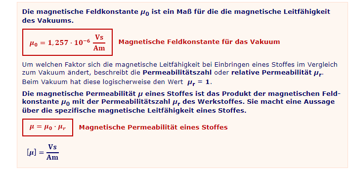
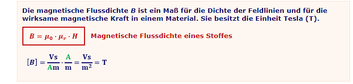
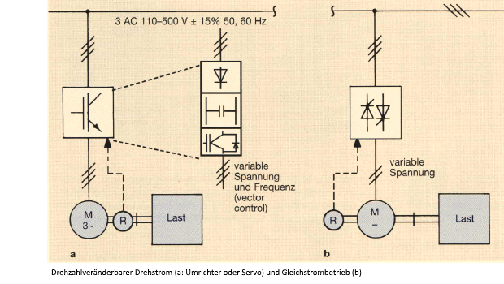

.. |nbsp|   unicode:: U+00A0 .. NO-BREAK SPACE

Grundlagen elektrischer Maschinen
=================================

|

------------

|

Allgemeine Grundlagen
---------------------

Elektrische Maschinen dienen der **Umformung von Energie**  

*  |nbsp| |nbsp| |nbsp| \- |nbsp| Generatoren **erzeugen elektrische Energie**  aus mechanischer Energie
*  |nbsp| |nbsp| |nbsp| \- |nbsp| Motoren **erzeugen mechanische Energie** aus elektrischer Energie 
*  |nbsp| |nbsp| |nbsp| \- |nbsp| Rotierende Umformer **wandeln Frequenz und Spannung** elektrischer Energie

|

Trotz aller Vielfalt im konstruktiven Detail, nach dem elektrische Maschinen ausgeführt sein können, Iässt sich ihre Wirkungsweise stets durch Anwendung von nur drei physikalischen Grundgesetzen verstehen und beschreiben: 

* Das **Induktionsgesetz**, das **Durchflutungsgesetz** und das **Kraftwirkungsgesetz**.

|

|

Das magnetische Feld
^^^^^^^^^^^^^^^^^^^^

Je größer die Zahl der nebeneinander liegenden und gleichsinnig vom Strom durchflossenen Leiter ist, desto stärker ist das die Leiter umschließende magnetische Feld. Das Magnetfeld der Spule ist mit dem eines Stabmagneten vergleichbar. Dort wo die Feldlinien die Spule verlassen, bildet sich ein magnetischer Nordpol; dort wo sie in die Spule eindringen, ein Südpol.  

Die Spule stellt somit ein Magnet dar, der sich elektrisch ein- und ausschalten lässt (Elektromagnet). Allerdings ist für die Ausbildung eines starken Magnetfeldes in der Luftspule ein relativ hoher Strom notwendig, der mit einem größeren Querschnitt für den Wickeldraht (Vermeidung einer unzulässigen Erwärmung der Wicklung) verbunden ist.

   
|

|

Die magnetischen Grundgrößen
^^^^^^^^^^^^^^^^^^^^^^^^^^^^

Bei einem Stromfluss durch einen kreisförmigen Leiter, entstehen konzentrische Feldlinien um den Leiter. Fließt ein Strom in den Leiter hinein, verlaufen die Feldlinien im Uhrzeigersinn. Wird die Stromrichtung umgekehrt, ändert sich die Richtung der Feldlinien. Die magnetische Kraft bzw. Stärke des Feldes ist von der Höhe des fließenden Stromes und vom Abstand zum Leiter abhängig.

|

Obige Gleichung zeigt die magnetische Kraftwirkung um einen geraden Leiter im Zusammenhang mit der magnetischen Feldstärke H (magnetische Kraft).
Die Gleichungen unten zeigen, welche Größen die magnetische Feldstärke einer zylindrischen Luftspule beeinflussen.

|

|

|

Die magnetische Wirkung einer Spule lässt sich erheblich steigern, wenn in den Spulenhohlraum ein massives zylindrisches Eisenstück eingeführt wird. Jedes im Spulenkörper befindliche Medium wird von den Feldlinien durchdrungen. Da bei konstanter Feldstärke und Feldlinienzahl die Stoffe Luft und Eisen sehr unterschiedlich Kraftwirkungen verursachen, scheint jeder Stoff einen bestimmten **magnetischen Widerstand** zu verursachen. Der magnetische Widerstand von Eisen ist geringer als der von Luft oder anders formuliert, die **magnetische Leitfähigkeit** des Eisens ist höher. Durch die Magnetfeld verstärkende Wirkung des Kernmaterials entsteht ein starker Elektromagnet.  

|

|

   **Die verstärkende Wirkung beruht darauf, dass bestimmte Materialien ihre Elementarmagnete unter dem Einfluss magnetischer Fremdfelder ausrichten und damit selbst zu einem Magneten werden.** 

Zu ihnen gehören Eisen, Kobalt und Nickel. Sie sind „ferromagnetisch“. Aufgrund dieser Eigenschaft, besitzen sie eine gute magnetische Leitfähigkeit. Die Leitfähigkeit ist allerdings stark von der Stärke des äußeren Magnetfeldes abhängig.

Die Veränderung der magnetischen Leitfähigkeit durch bestimmte Stoffe wird mit Hilfe der **magnetischen Permeabilität µ** beschrieben. Sie ist vergleichbar mit der Permittivität des Kondensators. Als Maßstab dient auch hier der materiefreie Raum – das Vakuum. Im Vakuum ist die Permeabilität eine konstante Größe. Der absolute Wert dieser Größe wird **absolute Permeabilität** oder **magnetische Feldkonstante µ0** genannt.

|

|

|

   **Eine höhere magnetische Leitfähigkeit führt zu einer Verdichtung der Feldlinien und somit zu einer Konzentration des magnetischen Feldes innerhalb des in die Spule eingebrachten Stoffes.** Die höhere Feldliniendichte erzeugt eine größere magnetische Kraft.

|

Das Produkt aus der magnetischer Feldstärke und der Permeabiltät macht eine Aussage über die Feldliniendichte. Sie wird **magnetische Flussdichte B** oder **magnetische Induktion** genannt.

|

|

|

   **Nur die magnetische Flussdichte B kann etwas über die Stärke eines Magnetfeldes aussagen, denn nur sie berücksichtigt die Permeabilität und somit die magnetische Leitfähigkeit eines Materials bzw. der Luft.**

|

------------

|

Drehstrom oder Gleichstrom?
^^^^^^^^^^^^^^^^^^^^^^^^^^^

Ein Rückblick auf die Entwicklung zeigt den Weg. War früher ein Antrieb mit fester Drehzahl über einen Drehstromasynchronmotor mit Verteilung der mechanischen Leistung über Transmissionen üblich, ging der Trend Ende der 90er verstärkt zum angepassten Einzelmotorenantrieb (Module). Der Einsatz der Halbleitertechnik begünstigte diese Entwicklung.

Zunächst fanden **Halbleitergeräte als netzgeführte Stromrichter oder Steller im Gleichstrombereich** Eingang in die Technik der drehzahlvariablen Antriebe. Damit kann die Ankerspannung eines Gleichstrommotors und damit die Drehzahl in weiten Bereichen kontinuierlich und nahezu verlustfrei verstellt werden. Die Verstellung kann erfolgen; verschleißbehaftete Stellwiderstände usw. entfallen. Über den Ankerstrom kann damit auch gleichzeitig das Drehmoment geregelt begrenzt werden. Auf diesem Wege lassen sich Antriebe aufbauen, die sanft und ruckfrei anlaufen, die gewünschte vorgewählto Drehzahl lastunabhängig halten und mit einer hohen Dynamik arbeiten.  

Der Gleichstrommotor benötigt einen mechanischen Stromwenderapparat. Hierin begründet liegt — trotz stark verbesserter Bürstenstandzeiten von bis zu 20.000 Betriebsstunden — wegen des Verschleißes an Stromwender und Bürsten ein gewisser Wartungsaufwand. Überdies erfordert der Stromwender Rücksichtnahme manchen Einsatzfällen, z. B. bei aggressiver Atmosphäre, Rüttelkräften, hohen Drehzahlen über 4.500 min-l oder bei Stillstandsbelastung.  

Bei solchen Einsatzfällen hat der **Drehstrommotor mit Kurzschlussläufer** Vorteile, da bei ihm die elektrische Leistung verschleißfrei über das Drehfeld vom Ständer auf den Läufer übertragen wird. Die einfach aufgebaute Käfigwicklung im Läufer lässt hohe Drehzahlen zu; die vollständige Kapselung ermöglicht den Betrieb in fast jeder Umgebung. Der Einsatz der Frequenzumrichter zur Speisung der Drehfeldmaschinen brachte so eine Umorientierung der elektrischen Antriebstechnik.

|

|

War der Drehstrommotor bislang an die vom Netz vorgegebene feste synchrone Drehzahl gebunden, so ermöglichte es der **Frequenzumrichter** aus jedem Drehstrom-Normmotor
einen drehzahlvariablen Antrieb zu machen. Frequenz und Spannung des Wechselstrom- oder Drehstromnetzes werden vom Frequenzumrichter so variiert, dass der Motor in weiten
Stellbereichen drehzahlvariabel betrieben werden kann. Die Elektronik erlaubt dabei eine gute Anpassung an die Charakteristiken der Arbeits- oder Kraftmaschinen. Die Einführung der
Digitaltechnik brachte auch der Regelverfahren, die sogar bessere Dynamiken als die Gleichstromantriebe erreichen. Hier zeichnen Sich heute im Besonderen Servoantriebe, bestehend aus Servo-Umrichter und trägheitsmomentarmen Servomotoren, aus.

|

------------

|