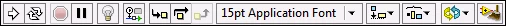
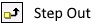
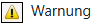
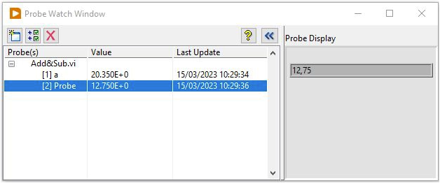
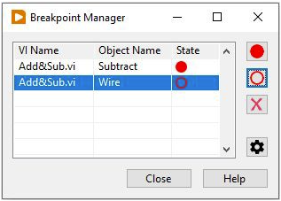
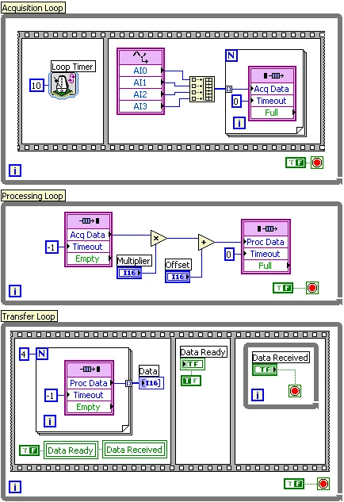
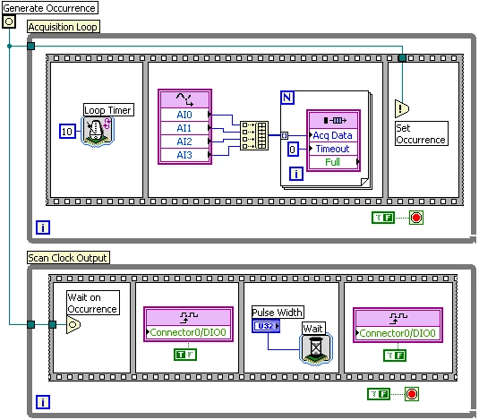

.. include:: <isonum.txt>
.. |br| raw:: html

    

LabView
=======

|

------------

|

Grundlagen
----------

LabVIEW-Programme werden als **virtuelle Instrumente** oder **VI**s bezeichnet, da mit ihnen Messinstrumente wie Oszilloskope oder Multimeter nachgeahmt werden. LabVIEW enthält eine Vielzahl von Werkzeugen zur Erfassung, Analyse, Darstellung und Speicherung von Daten sowie zur Fehlersuche in Programmcode.

In LabVIEW erstellen Sie mithilfe von Bedien- und Anzeigeelementen eine Benutzeroberfläche, die als **Frontpanel** bezeichnet wird. Bedienelemente sind Eingabeelemente wie Drehknöpfe, Druckschalter oder Drehregler. Zu den Anzeigeelementen zählen alle Ausgabeelemente wie Graphen oder LEDs. Nachdem Sie das Frontpanel erstellt haben, können Sie mit Hilfe von VIs und Funktionen den Programmcode zur Steuerung der Frontpanel-Objekte hinzufügen. Dieser Code befindet sich im Blockdiagramm.

LabVIEW ermöglicht die Kommunikation mit unterschiedlichsten Geräten, z.B. mit Datenerfassungskarten, Bildverarbeitungs- und Motorsteuerungsmodulen sowie GPIB-, PXI-, VXI und seriellen Geräten (RS-232 und RS-485).

|

Debugging
---------

Wenn das VI ausgeführt wird, aber falsche Ergebnisse liefert, liegt ein Funktionsfehler im Code vor. LabVIEW bietet mehrere Tools, mit denen wir analysieren können, wo sich das VI nicht wie erwartet verhält.

Wenn wir ein VI ausführen, werden in der Symbolleiste des Blockdiagramms Schaltflächen angezeigt, mit denen wir das VI debuggen können. Die folgende Symbolleiste wird im Blockdiagramm angezeigt:

|

|

Klicken wir auf die Schaltfläche **Ausführung hervorheben**, wird eine Animation der Blockdiagrammausführung angezeigt, wenn wir das VI ausführen. Dadurch lässt sich der Datenfluss durch das Blockdiagramm nachvollziehen. Durch erneutes Klicken auf die Schaltfläche wird die Hervorhebung der Ausführung deaktiviert.

|

|

Die Hervorhebung der Ausführung zeigt die Bewegung von Daten im Blockdiagramm von einem Knoten zum anderen mithilfe von Blasen, die sich entlang der Drähte bewegen. Verwenden wir die Hervorhebung der Ausführung in Verbindung mit Einzelschritten, kann man sehen, wie sich Datenwerte durch ein VI von Knoten zu Knoten bewegen. Man kann die Ausführung eines VIs jederzeit unterbrechen, indem man auf die Schaltfläche „Pause“ in der Symbolleiste klickt:

|

|

Wenn das VI angehalten wird, wechselt die Farbe der Schaltfläche zu Rot. 

|

**Sobald man das VI anhält, können wir die folgenden Tools verwenden, um zusätzliche Einblicke in die Ausführung Ihrer Anwendung zu erhalten:**

Klickt man auf die Schaltfläche **Drahtwerte beibehalten**, werden die Drahtwerte an jedem Punkt im Ausführungsfluss gespeichert, sodass wir beim Platzieren einer Sonde auf dem Draht sofort den aktuellsten Wert der Daten beibehalten können, die durch den Draht geleitet wurden.

|

|

Man muss das VI mindestens einmal erfolgreich ausführen, bevor die Drahtwerte beibehalten werden.

Wir klicken auf die Schaltfläche **Step Into**, um einen Knoten zu öffnen und anzuhalten.

|

|

Wenn wir erneut auf die Schaltfläche *Step Into* klicken, wird die erste Aktion ausgeführt und bei der nächsten Aktion des SubVIs oder der Struktur angehalten. Wir können auch die Tasten Strg und Pfeil nach unten drücken. Beim Durchlaufen eines VIs in Einzelschritten wird das VI Knoten für Knoten durchlaufen. Jeder Knoten blinkt, um anzuzeigen, wann er zur Ausführung bereit ist.

Wir klicken auf die Schaltfläche **Step Over**, um einen Knoten auszuführen und beim nächsten Knoten anzuhalten.

|

|

Man kann auch die Tasten Strg und Pfeil nach rechts drücken. Indem man über den Knoten geht, führt man ihn aus, ohne ihn in Einzelschritten zu durchlaufen.

Wir klicken auf die Schaltfläche **Step Out**, um die Ausführung des aktuellen Knotens zu beenden und anzuhalten.

|

|

Wenn die Ausführung des VIs abgeschlossen ist, wird die Schaltfläche *Step Out* grau dargestellt. Wir können auch die Tasten Strg und Pfeil nach oben drücken. Indem wir einen Knoten verlassen, durchlaufen wir den Knoten in Einzelschritten und navigieren zum nächsten Knoten.

Die Schaltfläche **Warnung** wird angezeigt, wenn ein VI eine Warnung enthält und wir das Kontrollkästchen Warnungen anzeigen im Fenster Fehlerliste aktiviert haben.

|

|

Eine Warnung weist darauf hin, dass ein potenzielles Problem mit dem Blockdiagramm vorliegt, verhindert jedoch nicht die Ausführung des VIs.

| 

Sondenüberwachungsfenster
^^^^^^^^^^^^^^^^^^^^^^^^^

Um Zwischenwerte auf einer Verbindung zu prüfen, verwendet man das Tool **„Probe“** ( *Ansicht* -> *Probe-Überwachungsfenster* ) während ein VI ausgeführt wird. Um eine Probe zu generieren, bewegt man den Cursor über eine Verbindung, während das VI ausgeführt wird, oder man klickt mit der rechten Maustaste auf die Verbindung und wählt „Probe“. Man verwendet das Tool „Probe“, wenn man ein kompliziertes Blockdiagramm mit einer Reihe von Operationen hat, von denen jede einzelne falsche Daten zurückgeben könnte. Am besten verwendet man das Tool „Probe“ mit *Ausführungshervorhebung*, *Einzelschritten* und *Haltepunkten*, um festzustellen, ob und wo Daten falsch sind. Wenn Daten verfügbar sind, aktualisiert die Probe die Daten sofort und zeigt sie im Probe-Überwachungsfenster während der Ausführungshervorhebung, Einzelschritten oder wenn Sie an einem Haltepunkt anhalten, an. 

|

|

Wenn die Ausführung an einem Knoten aufgrund einer Einzelschrittausführung oder eines Haltepunkts angehalten wird, kann man auch die gerade ausgeführte Verbindung prüfen, um den Wert anzuzeigen, der durch diese Verbindung geflossen ist.

|

Haltepunkt-Manager
^^^^^^^^^^^^^^^^^^

Mit dem Haltepunkt-Manager ( *Ansicht* -> *Haltepunkt-Manager* ) kann man Haltepunkte in Ihrem Code anzeigen, hinzufügen oder löschen. Ein Haltepunkt unterbricht die Ausführung des VIs, wenn das entsprechende Objekt ausgeführt wird. Man kann es auf ein VI, eine Struktur, eine Verbindung oder einen Operator platzieren.

|

|

|

FPGA (im LabVIEW-Kontext)
-------------------------

Mithilfe des LabVIEW FPGA-Moduls können Entwickler eine Vielzahl von Datenerfassungs- und Verarbeitungsroutinen implementieren, die auf FPGA-Zielen wie RIO- und CompactRIO-Geräten ausgeführt werden. **Die Hardwareausführung bietet eine höhere Leistung und Determinismus als die meisten prozessorbasierten Softwarelösungen.** Sobald der Code kompiliert und auf dem FPGA ausgeführt wird, läuft er ohne das mit der Softwareausführung und Thread-Priorisierung verbundene Jitter, das für die meisten gängigen Betriebssysteme typisch ist und in Echtzeitbetriebssystemen sogar in viel geringerem Maße auftritt.

Die grafische Programmiermethode von LabVIEW ist von Natur aus parallel und eignet sich für die Entwicklung hochparallelen Codes. **Auf einem CPU-basierten Ziel wie Windows wird der grafische Code in die serielle Programmausführung eingeplant, wobei alle Funktionen und Vorgänge sequenziell auf dem Prozessor ausgeführt werden.** Der LabVIEW-Scheduler kümmert sich um die Verwaltung mehrerer Schleifen, Timings, Prioritäten und anderer Einstellungen, die bestimmen, wann jede Funktion ausgeführt wird. Dieser sequenzielle Vorgang verursacht eine zeitliche Interaktion zwischen verschiedenen Teilen einer Anwendung und erzeugt Jitter bei der Programmausführung.

Auf einem FPGA-basierten Ziel wird jeder Anwendungsprozess (Teilmenge der von Ihnen definierten Anwendung) :underline:`innerhalb einer Schleifenstruktur` implementiert. Das LabVIEW-Diagramm wird den FPGA-Gates und -Slices zugeordnet, **sodass parallele Schleifen im Blockdiagramm in verschiedenen Abschnitten der FPGA-Struktur implementiert werden.** Dadurch können alle Prozesse gleichzeitig (parallel) ausgeführt werden. Die Zeitabfolge jedes Prozesses ist unabhängig vom Rest des Diagramms, wodurch Jitter vermieden wird. Dies bedeutet auch, dass Sie zusätzliche Schleifen hinzufügen können, ohne die Leistung zuvor implementierter Prozesse zu beeinträchtigen. Sie können Operationen hinzufügen, die die Interaktion zwischen Schleifen zur Synchronisierung oder zum Austausch von Daten ermöglichen.

|

Parallele Ausführung
^^^^^^^^^^^^^^^^^^^^

Durch die parallele Natur der grafischen Programmierung und die wirklich parallele Implementierung des LabVIEW-Diagramms auf dem FPGA können Sie **die Ausführungsgeschwindigkeit weiter optimieren, indem Sie Ihren Anwendungscode in kleinere Prozesse partitionieren**. Dadurch kann jeder Prozess eine höhere Schleifenrate und eine insgesamt höhere Ausführungsrate für die Anwendung erreichen, als wenn die gesamte Anwendung in einer Schleife ausgeführt würde.

Beispielsweise kann eine typische DAQ-Anwendung in **Prozesse für die Datenerfassung, Datenverarbeitung und Datenübertragung** an eine Hostanwendung partitioniert werden. Diese Aufgaben könnten als Sequenz in einer einzigen Schleife implementiert werden, könnten aber auch als drei separate Schleifen codiert werden, wie unten gezeigt.

|

|

Datenübertragung und -synchronisierung zwischen parallelen Schleifen oder Codesegmenten können mithilfe von Standard-LabVIEW-FPGA-Tools wie 

- *FIFOs* und 
- *Occurrence*  

abgewickelt werden.

**FIFOs** ermöglichen das Speichern und Puffern von Daten in Ihrer FPGA-Anwendung und sind daher nützlich, um Daten zwischen zwei verschiedenen Teilen des Blockdiagramms oder an SubVIs weiterzugeben. Sie können auch verwendet werden, um zwei verschiedene Schleifen zu synchronisieren, sodass die empfangende Schleife basierend auf den empfangenen Daten mit der sendenden synchronisiert wird. In einem FPGA-VI können mehrere FIFOs erstellt werden, und jedes FIFO kann mit einem individuellen Datentyp und einer individuellen Tiefe konfiguriert werden. Für den Blockspeicher konfigurierte FIFOs teilen sich den auf dem FPGA verfügbaren Benutzerspeicher und verbrauchen selbst keines der FPGA-Gates. :underline:`Mithilfe des Timeout-Parameters an den FIFO-Lese- und Schreibknoten können Sie das individuelle Verhalten dieser Knoten konfigurieren.`

FIFO 'Timeout'
++++++++++++++

**Schreiben** FIFO Methode

*Timeout* gibt die Anzahl der Taktimpulse an, die die Funktion auf freien Speicherplatz im FIFO wartet, :underline:`wenn der FIFO voll ist.`

.. list-table::
   :header-rows: 1

   * - Wert
     - Bedeutung
   * - -1
     - verhindert, dass die Funktion ein Timeout durchführt. => Blockiert das .vi an dieser Stelle bis Daten kommen!
   * - 0
     - keine Wartezeit.
   * - >1
     - Wartezeit auf freien Speicher in Taktimpulsen

Wenn *Timeout?* TRUE ist, schreibt die Funktion das Element nicht in den FIFO.

|

**Lesen** FIFO Methode

*Timeout* gibt die Zeit in Taktimpulsen an, die die Methode auf verfügbare Daten im FIFO wartet, :underline:`wenn der FIFO leer ist.`

.. list-table::
   :header-rows: 1

   * - Wert
     - Bedeutung
   * - -1
     - verhindert, dass die Funktion ein Timeout durchführt. => Blockiert das .vi an dieser Stelle bis Daten kommen!
   * - 0
     - keine Wartezeit. => FIFO-Methodenknoten als *zeitgesteuerte Einzelzyklusschleife*
   * - >1
     - Wartezeit auf neue Daten in Taktimpulsen

Wenn *Timeout?* TRUE ist, ist das Element undefiniert und es erfolgt kein Lesevorgang.

|

Wenn eine Synchronisierung zwischen zwei Schleifen erforderlich ist, die keine Daten direkt austauschen, können Sie **Occurrence** verwenden. Ein Occurrence ermöglicht es Ihnen, eine Schleife mithilfe der Funktion *„Wait for Occurrence“* zu blockieren, bis eine andere Schleife einen bestimmten Vorgang abgeschlossen hat und die Funktion *„Set Occurrence“* aufruft, wie im folgenden Diagramm dargestellt.

|

|

Diese Technik kann auf nahezu jede Anwendung angewendet werden. Indem Sie den Datenfluss innerhalb Ihrer Anwendung betrachten, können Sie verschiedene Prozesse identifizieren, die unabhängig voneinander ausgeführt werden können, auch wenn sie im größeren Schema der Anwendung synchronisiert werden müssen. Dieser modulare Programmieransatz verbessert nicht nur die Leistung, sondern hilft Ihnen auch dabei, Ihren Anwendungscode zu organisieren und zu verwalten. So können Sie Ihre Anwendung einfacher testen und debuggen und die Codewiederverwendung in zukünftigen Anwendungen mit ähnlichen Anforderungen verbessern.

