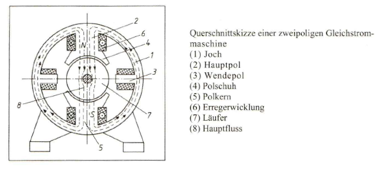
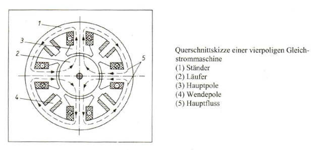
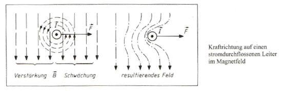
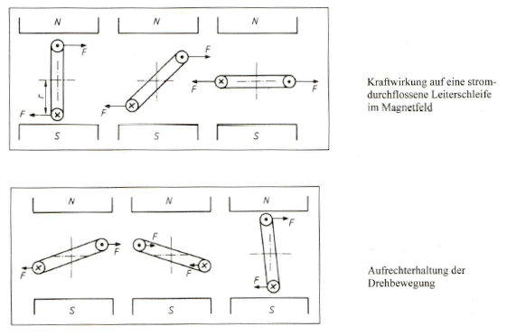

.. include:: <isonum.txt>

Gleichstrommaschine
===================

|

------------

|

Aufbau
------

Jede rotierende elektrische Maschine besteht aus einem feststehenden Teil, dem :navy:`Ständer (Stator)`, und einem rotierenden Teil, dem :navy:`Läufer (Rotor)`. 

   :navy:`Derjenige Teil einer Maschine, in dem Spannungen induziert werden, wird als Anker bezeichnet; bei der Gleichstrommaschine trägt der Läufer die Bezeichnung Anker.`

Meist ist die ganze Maschine zylinderförmig und wird abgeschlossen durch die Lagerschilde an den Stirnseiten des Ständers. Die Lagerschilde halten den Läufer konzentrisch in der Bohrung des Ständers.

.. raw:: html

   &nbsp; 
   &nbsp; 
   &nbsp; 
   &nbsp;

Der Ständer
^^^^^^^^^^^

Der Ständer besteht aus dem hohlzylindrischen :navy:`Joch (1)` und den daran befestigten Polen. Da diese Teile keinem magnetischen Wechselfeld unterworfen sind, werden sie aus Guss- oder Walzstahl gefertigt. Die Pole, bestehend aus :navy:`Hauptpolen (2)` und :navy:`Wendepolen (3`), werden innen im Joch angeschraubt; die Hauptpole sind unterteilt in den :navy:`Polkern (5)`, über den die :navy:`Erregerwicklung (6)` gelegt wird, und den :navy:`Polschuh (4)`, der das System zum :navy:`Läufer (7)` hin abschließt (Bild unten).

|

|

Die Erregerwicklungen auf den Hauptpolen sind in Reihe geschaltet und werden mit Gleichstrom gespeist. Bei der eingezeichneten Stromrichtung erzeugen sie einen magnetischen :navy:`Fluss (8) (Hauptfluss)`, der aus dem oberen Hauptpol austritt (Nordpo[), über den Luftspalt in den magnetisch gutleitenden Läufer eintritt und vom Läufer über den zweiten Luftspalt in den unteren Hauptpol (Südpol) fließt. Da magnetische Feldlinien stets auf einem in sich geschlossenen Weg verlaufens dient das Joch als Rückschluss der Feldlinien vom Südpol zum Nordpol, wobei die rechte und linke Jochhälfte je den halben Fluss führen.

Die Wendepole, erregen bei belasteter Maschine ebenfalls einen magnetischen Fluss, der jedoch nicht zur eigentlichen Funktion der Maschine beiträgt.

Das Bild oben zeigt eine zweipolige Maschine (man sprieht auch von Polpaarzahl p = 1); je ein Nord- und ein Südpol ergeben ein Polpaar. In der Praxis werden jedoch nur vier- oder mehrpolige Maschinen (p >= 2) verwendet; ausschließlich Kleinstmotoren werden zweipolig konstruiert. Mehrpolige Gleichstrommaschinen werden deshalb bevorzugt, weil bei ihnen das Material besser ausgenutzt werden kann und weil sie bessere Eigenschaften bei niedrigen Drehzahlen aufweisen als zweipolige Austührungen. Das Bild unten zeigt die Anordnung der Pole und die Flussverteilung bei einer vierpoligen Maschine.

|

|

Der Läufer
^^^^^^^^^^

Der Läufer (Anker) besteht aus einem zylindrischen Paket von vielen aufeinandergeschichteten und voneinander isolierten Blechen, die auf der Welle befestigt sind. Durch diesen Schichtaufbau — ähnlich der Aufbau weise eines Transformatorkernes — wird verhindert, dass sich im Eisenkern des Läufers ausgeprägte Wirbelströme bilden können. In der Gleichstrommaschine wird zwar kein Wechselfluss erregt, sondern ein zeitlich konstanter Hauptfluss, der sich jedoch für ein betrachtetes Volumenelement des rotierenden Läuferkernes so auswirkt, dass dies Volumenelement einer ständigen Ummagnetisierug
unterliegt.

Infolge dieser Ummagnetisierung entstehen im Läufer neben den Wirbelstrom- auch Hystereseverluste. Um die Hystereseverluste klein zu halten, verwendet man magnetisch weiches Eisen, d. h., Eisen mit schmaler Hystereseschleife (die Fläche der Hystereseschleife ist ein Maß für die Ummagnetisierungsarbeit pro Umlauf). Die Oberfläche des Läufers ist mit Nuten versehen, die in axialer Richtung verlaufen. Sie nehmen die Windungen der Läuferwicklung auf und sind nach außen hin mit einem Verschlusskeil versehen, damit die einzelnen Leiter nicht durch die auftretenden Fliehkräfte aus den Nuten herausgepresst werden. Bei kleinen Maschinen bestehen die Leiter aus lackisoliertem Wicklungsdraht, bei Maschinen großer Leistung aus Rechteckprofil-Kupferbändern mit lackgetränkter Baumwoll- Oder Glasseidenisolation.

Bei sehr großen Maschinen würden die Rechteckleiter in den Nuten derart große radiale Abmessungen aufweisen, dass erhebliche Stromverdrängungserscheinungen zum Luftspalt der Maschine hin auftreten würden. Deshalb Wird der Leiter in mehrere voneinander isolierte Rechteckleiter geringerer Querschnittsfläche aufgeteilt, die innerhalb der Nut jeweils einmal verdrillt sind (Roebelstab), so dass alle Teilleiter im Mittel den gleichen Induktionseinflüssen unterliegen und damit auch mit gleichen Teilströmen belastet sind.

An den beiden Stirnseiten treten die Leiter aus den Nuten heraus, verlaufen bogenförmig weiter und treten in eine andere Nut ein; die Stirnverbindungen sind dabei so ausgelegt, dass an den Stirnseiten des Läufers stets Leiter, die Sich im Bereich eines magnetischen Nordpols befinden, mit solchen Leitern verbunden werden, die an der entsprechenden Stelle unter dem dazugehörenden Südpol verlaufen. Die so gebildeten Drahtwülste der Wicklungsdrähte aller Nuten bilden die Wicklungsköpfe. An einer Seite des Läufers sind diese Wicklungsdrähte an die Lamellen eines :navy:`Stromwenders (Kollektor, Kommutator)` angeschlossen. Dieser ist ein zylindrischer Körper, an dessen Umfang Kupferstreifen in
axialer Richtung nebeneinander angeordnet und voneinander isoliert befestigt sind. Der Stromwender dient in Verbindung mit den Kohlebürsten, die durch Federdruck auf die Lamellen des Stromwenders gepresst werden, der Stromzuführung zum rotierenden Läufer.

Auf der dem Stromwender gegenüberliegenden Läuferseite - bei normaler Bauart das freie Wellenende - ist das Lüfterrad (Ventilator) aufgeschrumpft, das Kühlluft von außen ansaugt und axial durch die Maschine drückt. Die erwärmte Luft tritt kollektorseitig am Lagerschild wieder aus und führt gleichzeitig den Abrieb der Kollektorbürste mit nach außen.

.. raw:: html

   &nbsp; 
   &nbsp; 
   &nbsp; 
   &nbsp;

Die Wirkungsweise
-----------------

Grundlagen
^^^^^^^^^^

Aus den Grundlagen über das magnetische Feld ist bekannt, dass auf einen stromdurchflossenen Leiter im Magnetfeld eine Kraft ausgeübt wird. Der Betrag der Kraft F berechnet sich aus 

.. code-block::

       F = l * I * B * sin(a)
	   
	   l   Länge des Leiters im Magnetfeld
	   I   Strom im Leiter
	   B   Induktion des Magnetfeld

mit *a* als Winkel zwischen Strom- und Induktionsrichtung. Verlaufen Strom und Magentfeld senkrecht zueinander (*a* = 90°), vereinfacht es sich zu

.. code-block::

       F = l * I * B

Die Richtung der Kraft F erhält man, wenn man auf kürzestem Wege von der Stromrichtung zur Richtung des Magentfeldes übergeht. Aus dieser vollzogenen Drehung resultiert - bezogen auf den Gang einer Schraube mit Rechtsgewinde - eine Schraubenbewegung die mit der Richtung der Kraft identisch ist.

Das Bild unten zeigt, wie die Kraftrichtung auf anschauliche Weise bestimmt werden kann. Ein stromdurchflossener Leiter (Stromrichtung aus der Zeichenebene heraus) liegt in einem konstanten Magnetfeld der Induktion B. Der Strom baut ein Eigenfeld auf (bei der hier vorgegebenen Stromrichtung verläuft das Eigenfeld gegen den Uhrzeigersinn); beide Felder überlagern sich zu einem resultierenden Feld mit unterschiedlicher Stärke zu beiden Seiten des Leiters. Die Kraft F ist nun so gerichtet, dass sie den Leiter immer in den Bereich der :navy:`Feldschwächung` bewegen will.

|

|

Erweitern wir diese Erkenntnisse auf eine drehbar gelagerte stromdurchflossene Leiterschleife im Magnetfeld (Bild unten), so ergeben sich Kräfte an den Leiterabschnitten, die in Verbindung mit dem Hebelarm r zu einem Moment führen, das die Anordnung in eine Lage senkrecht zum Magnetfeld ausrichtet.

|

|

In dieser Stellung würde das System verharren. Um eine Drehbewegung aufrechtzuerhalten, ist es deshalb notwendig, dass die Kraftrichtung immer dann geändert wird, wenn die Leiterschleife die zum Magnetfeld senkrechte Ebene (neutrale Zone) durchläuft |rarr| **dies wird durch eine Stromrichtungsumkehr im Leiter erzielt**.

.. raw:: html

   &nbsp; 
   &nbsp; 
   &nbsp; 
   &nbsp;
   
Der Motorbetrieb
^^^^^^^^^^^^^^^^

Der Generatorbetrieb
^^^^^^^^^^^^^^^^^^^^

Die Wendepol- und Kompensationswicklung
^^^^^^^^^^^^^^^^^^^^^^^^^^^^^^^^^^^^^^^

.. raw:: html

   &nbsp; 
   &nbsp; 
   &nbsp; 
   &nbsp;

Eigenschaften
-------------