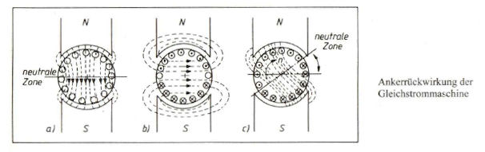
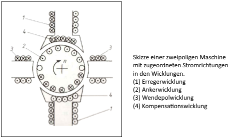
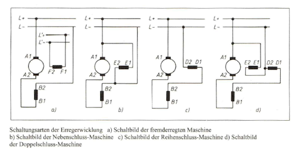
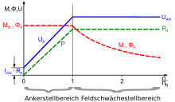

.. include:: <isonum.txt>
.. |br| raw:: html

    

Gleichstrommaschine
===================

|

------------

|

Überblick
---------

Jede rotierende elektrische Maschine besteht aus einem feststehenden Teil, dem :navy:`Ständer (Stator)`, und einem rotierenden Teil, dem :navy:`Läufer (Rotor)`. 

   :navy:`Derjenige Teil einer Maschine, in dem Spannungen induziert werden, wird als Anker bezeichnet; bei der Gleichstrommaschine trägt der Läufer die Bezeichnung Anker.`

Meist ist die ganze Maschine zylinderförmig und wird abgeschlossen durch die Lagerschilde an den Stirnseiten des Ständers. Die Lagerschilde halten den Läufer konzentrisch in der Bohrung des Ständers.

|

Gleichstrommotoren werden in zwei Untergruppierungen aufgeteilt. Das wären zum einen der :navy:`permanenterregte` und zum anderen der :navy:`elektrisch` erregte Gleichstrommotor. Beim permanenterregten Gleichstrommotor ist der Stator ein Permanentmagnet und nur der Rotor ein Elektromagnet. Diese Art von Gleichstrommotoren kommt beispielsweiße bei Auto-Anlassern zum Einsatz.

Die andere Form ist der elektrisch erregte Gleichstrommotor. Bei dieser Art von Motor sind beide Hauptbauteile Elektromagneten. Bei den elektrisch erregten Gleichstrommotoren unterscheidet man ein weiteres Mal zwischen Reihenschlussmotor, Nebenschlussmotor und dem fremderregten Motor (Anker- und Erregerwicklung werden aus zwei unterschiedlichen und getrennt voneinander einstellbaren Gleichstromstellern gespeist). Neben- und Reihenschlussmotor haben eine einzige Spannungsquelle für Anker- und Erregerwicklung, werden aber unterschiedlich verschaltet (mehr dazu unten)

.. raw:: html

   &nbsp; 
   &nbsp; 
   &nbsp; 
   &nbsp;

Der Ständer
-----------

Der Ständer besteht aus dem hohlzylindrischen :navy:`Joch (1)` und den daran befestigten Polen. Da diese Teile keinem magnetischen Wechselfeld unterworfen sind, werden sie aus Guss- oder Walzstahl gefertigt. Die Pole, bestehend aus :navy:`Hauptpolen (2)` und :navy:`Wendepolen (3`), werden innen im Joch angeschraubt; die Hauptpole sind unterteilt in den :navy:`Polkern (5)`, über den die :navy:`Erregerwicklung (6)` gelegt wird, und den :navy:`Polschuh (4)`, der das System zum :navy:`Läufer (7)` hin abschließt (Bild unten).

|

.. image:: pics/dc_staender.png
   :width: 650px

|

Die Erregerwicklungen auf den Hauptpolen sind in Reihe geschaltet und werden mit Gleichstrom gespeist. Bei der eingezeichneten Stromrichtung erzeugen sie einen magnetischen :navy:`Fluss (8) (Hauptfluss)`, der aus dem oberen Hauptpol austritt (Nordpol), über den Luftspalt in den magnetisch gutleitenden Läufer eintritt und vom Läufer über den zweiten Luftspalt in den unteren Hauptpol (Südpol) fließt. Da magnetische Feldlinien stets auf einem in sich geschlossenen Weg verlaufens dient das Joch als Rückschluss der Feldlinien vom Südpol zum Nordpol, wobei die rechte und linke Jochhälfte je den halben Fluss führen.

Die Wendepole, erregen bei belasteter Maschine ebenfalls einen magnetischen Fluss, der jedoch nicht zur eigentlichen Funktion der Maschine beiträgt.

Das Bild oben zeigt eine zweipolige Maschine (man spricht auch von Polpaarzahl p = 1); je ein Nord- und ein Südpol ergeben ein Polpaar. In der Praxis werden jedoch nur vier- oder mehrpolige Maschinen (p >= 2) verwendet; ausschließlich Kleinstmotoren werden zweipolig konstruiert. Mehrpolige Gleichstrommaschinen werden deshalb bevorzugt, weil bei ihnen das Material besser ausgenutzt werden kann und weil sie bessere Eigenschaften bei niedrigen Drehzahlen aufweisen als zweipolige Austührungen. Das Bild unten zeigt die Anordnung der Pole und die Flussverteilung bei einer vierpoligen Maschine.

|

.. image:: pics/dc_staender2.png
   :width: 650px

|

Der Läufer
----------

Der Läufer (Anker) besteht aus einem zylindrischen Paket von vielen aufeinandergeschichteten und voneinander isolierten Blechen, die auf der Welle befestigt sind. Durch diesen Schichtaufbau — ähnlich der Aufbau weise eines Transformatorkernes — wird verhindert, dass sich im Eisenkern des Läufers ausgeprägte Wirbelströme bilden können. In der Gleichstrommaschine wird zwar kein Wechselfluss erregt, sondern ein zeitlich konstanter Hauptfluss, der sich jedoch für ein betrachtetes Volumenelement des rotierenden Läuferkernes so auswirkt, dass dies Volumenelement einer ständigen Ummagnetisierug
unterliegt.

Infolge dieser Ummagnetisierung entstehen im Läufer neben den Wirbelstrom- auch Hystereseverluste. Um die Hystereseverluste klein zu halten, verwendet man magnetisch weiches Eisen, d. h., Eisen mit schmaler Hystereseschleife (die Fläche der Hystereseschleife ist ein Maß für die Ummagnetisierungsarbeit pro Umlauf). Die Oberfläche des Läufers ist mit Nuten versehen, die in axialer Richtung verlaufen. Sie nehmen die Windungen der Läuferwicklung auf und sind nach außen hin mit einem Verschlusskeil versehen, damit die einzelnen Leiter nicht durch die auftretenden Fliehkräfte aus den Nuten herausgepresst werden. Bei kleinen Maschinen bestehen die Leiter aus lackisoliertem Wicklungsdraht, bei Maschinen großer Leistung aus Rechteckprofil-Kupferbändern mit lackgetränkter Baumwoll- Oder Glasseidenisolation.

Bei sehr großen Maschinen würden die Rechteckleiter in den Nuten derart große radiale Abmessungen aufweisen, dass erhebliche Stromverdrängungserscheinungen zum Luftspalt der Maschine hin auftreten würden. Deshalb Wird der Leiter in mehrere voneinander isolierte Rechteckleiter geringerer Querschnittsfläche aufgeteilt, die innerhalb der Nut jeweils einmal verdrillt sind (Roebelstab), so dass alle Teilleiter im Mittel den gleichen Induktionseinflüssen unterliegen und damit auch mit gleichen Teilströmen belastet sind.

An den beiden Stirnseiten treten die Leiter aus den Nuten heraus, verlaufen bogenförmig weiter und treten in eine andere Nut ein; die Stirnverbindungen sind dabei so ausgelegt, dass an den Stirnseiten des Läufers stets Leiter, die Sich im Bereich eines magnetischen Nordpols befinden, mit solchen Leitern verbunden werden, die an der entsprechenden Stelle unter dem dazugehörenden Südpol verlaufen. Die so gebildeten Drahtwülste der Wicklungsdrähte aller Nuten bilden die Wicklungsköpfe. An einer Seite des Läufers sind diese Wicklungsdrähte an die Lamellen eines :navy:`Stromwenders (Kollektor, Kommutator)` angeschlossen. Dieser ist ein zylindrischer Körper, an dessen Umfang Kupferstreifen in
axialer Richtung nebeneinander angeordnet und voneinander isoliert befestigt sind. Der Stromwender dient in Verbindung mit den Kohlebürsten, die durch Federdruck auf die Lamellen des Stromwenders gepresst werden, der Stromzuführung zum rotierenden Läufer.

Auf der dem Stromwender gegenüberliegenden Läuferseite - bei normaler Bauart das freie Wellenende - ist das Lüfterrad (Ventilator) aufgeschrumpft, das Kühlluft von außen ansaugt und axial durch die Maschine drückt. Die erwärmte Luft tritt kollektorseitig am Lagerschild wieder aus und führt gleichzeitig den Abrieb der Kollektorbürste mit nach außen.

.. raw:: html

   &nbsp; 
   &nbsp; 
   &nbsp; 
   &nbsp;

Die Wirkungsweise
-----------------

Grundlagen
^^^^^^^^^^

Aus den Grundlagen über das magnetische Feld ist bekannt, dass auf einen stromdurchflossenen Leiter im Magnetfeld eine Kraft ausgeübt wird. Der Betrag der Kraft F berechnet sich aus 

:math:`\quad F = l \cdot I \cdot B \cdot sin(a)`

:math:`\quad l \quad \,  \text{  Länge des Leiters im Magnetfeld}` |br|
:math:`\quad I \quad  \text{ Strom im Leiter}` |br|
:math:`\quad B \quad  \text{Induktion des Magnetfeld}` |br|

mit :math:`a` als Winkel zwischen Strom- und Induktionsrichtung. Verlaufen Strom und Magentfeld senkrecht zueinander (*a* = 90°), vereinfacht es sich zu

:math:`\quad F = l \cdot I \cdot B`

Die Richtung der Kraft F erhält man, wenn man auf kürzestem Wege von der Stromrichtung zur Richtung des Magentfeldes übergeht. Aus dieser vollzogenen Drehung resultiert - bezogen auf den Gang einer Schraube mit Rechtsgewinde - eine Schraubenbewegung die mit der Richtung der Kraft identisch ist.

Das Bild unten zeigt, wie die Kraftrichtung auf anschauliche Weise bestimmt werden kann. Ein stromdurchflossener Leiter (Stromrichtung aus der Zeichenebene heraus) liegt in einem konstanten Magnetfeld der Induktion B. Der Strom baut ein Eigenfeld auf (bei der hier vorgegebenen Stromrichtung verläuft das Eigenfeld gegen den Uhrzeigersinn); beide Felder überlagern sich zu einem resultierenden Feld mit unterschiedlicher Stärke zu beiden Seiten des Leiters. Die Kraft F ist nun so gerichtet, dass sie den Leiter immer in den Bereich der :navy:`Feldschwächung` bewegen will.

|

.. image:: pics/kraftAufLeiter.png
   :width: 552px

|

Erweitern wir diese Erkenntnisse auf eine drehbar gelagerte stromdurchflossene Leiterschleife im Magnetfeld (Bild unten), so ergeben sich Kräfte an den Leiterabschnitten, die in Verbindung mit dem Hebelarm :math:`r` zu einem Moment führen, das die Anordnung in eine Lage senkrecht zum Magnetfeld ausrichtet.

|

.. image:: pics/drehImMF.png
   :width: 561px

|

In dieser Stellung würde das System verharren. Um eine Drehbewegung aufrechtzuerhalten, ist es deshalb notwendig, dass die Kraftrichtung immer dann geändert wird, wenn die Leiterschleife die zum Magnetfeld senkrechte Ebene (neutrale Zone) durchläuft, :navy:`dies wird durch eine Stromrichtungsumkehr im Leiter erzielt`.

|

Um ein bei konstanter Drehzahl gleichbleibendes Moment zu erzeugen, verwendet man heute bei allen Gleichstrommaschinen die so genannte :navy:`Trommelwicklung`, die aus der Hintereinanderschaltung vieler einzelner Leiterschleifen auf der Mantelfläche eines zylindrischen Läufers (:navy:`Trommelanker`). Die Ankerleiter liegen immer in Nuten, damit nutzt man zwei Vorteile: Die Leiter sind mechanisch gut gegen Fliehkräfte gesichert, und der zwischen Polschuh und Läufer wirksame Luftspalt, der bei vorgegebenem Erregerstrom die Größe der magnetischen Feldstärke beeinflusst, wird klein gehalten.

Jede Leiterschleife ist mit einer Lamelle des Stromwenders verbunden, der in Verbindung mit den Kohlebürsten für die Stromzuführung zum rotierenden Läufer sorgt und so geschaltet ist, dass sich trotz rotierendem Anker eine konstante Stromrichtungsverteilung im Bereich von Nord- und Südpol des Erregerfeldes ergibt.

.. raw:: html

   &nbsp; 
   &nbsp; 
   &nbsp; 
   &nbsp;
   
Der Motorbetrieb
^^^^^^^^^^^^^^^^

Legt man die Erregerwicklungen im Ständer an eine Gleichspannung, so erzeugt der fließende Erregerstrom einen konstanten magnetischen Fluss, der vom Nordpol über Luftspalt und Anker zum Südpol verläuft und über den Ständer wieder zum Nordpol zurückgeführt wird. Beaufschlagt man die Läuferwicklung zusätzlich mit einem Strom, so wird ein Drehmoment auf den Läufer ausgeübt, das diesen in Rotation versetzt. Aufgrund der Drehung der Läuferwicklung im konstanten Magnetfeld wird in der Wicklung eine Spannung :math:`U_i` induziert, die der angelegten Ankerspannung entgegengerichtet ist und deren Größe abhängig ist vom konstruktiven Aufbau der Maschine, von der Stärke des Magnetfeldes und von der Umfangsgeschwindigkeit des Ankers, d.h. proportional der Ankerdrehzahl.

Es lässt sich folgender Ersatstromkreis aufstellen:

:math:`\quad U = U_i + I \cdot R_a`
	   
:math:`\quad U \quad \,  \text{am Anker angelegte Spannung}` |br|
:math:`\quad I \quad \;  \text{Ankerstrom}` |br|
:math:`\quad R_a \;\;  \text{ohmscher Widerstand des Ankerkreises}` |br|
:math:`\quad U_i \;\;\;  \text{am Anker induzierte Spannung}` |br|

Die am Anker angelegte Spannung U (Klemmenspannung) teilt sich auf in induzierte Spannung und Spannungsabfall über den ohmschen Widerständen im Ankerkreis.

Soll eine Maschine im Motorbetrieb ein Moment liefern, dann muss sie elektrische Leistung aufnehmen; es muss also bei angelegter Ankerspannung U in die Maschine ein Strom I hineinfließen. Dies ist immer dann der Fall, wenn die Klemmenspannung größer ist als die induzierte Spannung.

:math:`\quad \, \text{Motorbetrieb} \quad U > U_i`

Die Höhe des Ankerstromes ist proportional dem geforderten Moment

:math:`\quad M = F \cdot r` |br|
:math:`\quad F \; = l \cdot I \cdot B` |br|
:math:`\quad F \;\; \text{~} \;\; I` |br|
:math:`\quad M \; \text{~} \;\; I` |br|

	   
Das Moment erzwingt also einen bestimmten Strom, der wiederum resultieren muss aus

:math:`\quad \, I = \frac{U - U_i}{R_a}`
 
Dazu ist bei vorgegebenem Ankerkreiswiderstand eine Spannungsdifferenz notwendig, die sich über die induzierte Spannung :math:`U_i` durch Änderung der Motordrehzahl einstellt.

|

Bei :navy:`Lastverminderung` liefert ein Gleichstrommotor im Augenblick des Lastwechsels ein höheres Moment als gefordert. Das überschüssige Moment beschleunigt den Läufer, und die Drehzahl der Maschine steigt solange, bis die im Anker induzierte Spannung :math:`U_i` einen Wert erreicht, der den Ankerstrom so weit vermindert, wie dies für das neue Moment erforderlich ist.

Bei :navy:`Lasterhöhung` gilt Entsprechendes. Das zusätzliche Moment wirkt auf den Läufer bremsend und zwingt ihn zu geringeren Drehzahlen, die dann eine größere Spannungsdifferenz :math:`(U - U_i)` bewirken und für die Maschine einen höheren Ankerstrom ermöglichen.

|

Da die induzierte Spannung proportional der Drehzahl der Maschine ist (bei Φ = const.), ergibt sich für den Motorbetrieb - bezogen auf die angelegte Klemmenspannung U - ein festgelegtes Drehzahlintervall.

:math:`\quad \, \text{Motorbetrieb} \quad 0 <= n <= n_0`

wobei die :navy:`Leerlaufdrehzahl` :math:`n_0` dann erreicht wird, wenn die Maschine durch kein Moment belastet wird (weder Lastmoment noch Reibungs- und Eisenverluste). 

|

Der Generatorbetrieb
^^^^^^^^^^^^^^^^^^^^

Wir betrachten nach wie vor eine Gleichstrommaschine, deren Errecgerwicklung von einer konstanten Spannungsquelle gespeist wird (Φ = const.). Als Generator arbeitet die Maschine definitionsgemäß dann, wenn sie elektrische Leistung abgibt. :navy:`Dazu muss sie mechanisch angetrieben werden mit Drehzahlen, die bei gegebener Spannung U des einzuspeisenden Netzes höher liegen als die Leerlaufdrehzahl` :math:`n > n_0 = \frac{U}{(k_1 * Φ)}`, damit :math:`U_i > U` wird und ein Strom aus der Maschine ins Netz fließen kann. Es ergibt sich also ein negativer Strom, der in die Maschine hineinfließt. Aus dem Ersatstromkreis folgt die Spannungsgleichung:

:math:`\quad \, U = U_i - I \cdot R_a`
	   
Entsprechend der Gleichung kann ein Gleichstromgenerator gleichgesetzt werden mit einer Gleichspannungsquelle der Leerlaufspannung :math:`U_i = k_1 \cdot Φ \cdot n` und dem Innenwiderstand :math:`R_a`. Zusammenfassend kann man über den Betriebszustand einer Gleichstrommaschine sagen, dass bei Belastung ein Ankerstrom fließt, der in den ohmschen Widerständen des Ankerkreises Spannungsabfälle hervorruft; es weicht also die an den Anschlussklemmen der Maschine messbare Spannung U um diesen Spannungsabfall von der induzierten Spannung :math:`U_i` ab.

Ist :navy:`U > U_i`, so fließt ein Strom in die Maschine hinein; es wird elektrische Leistung aufgenommen (:navy:`Motorbetrieb`).

Ist :navy:`U < U_i`, so fließt ein Strom aus der Maschine hinaus; es wird elektrische Leistung abgegeben (:navy:`Generatorbetrieb`).

Für :navy:`U = U_i` befindet sich die Maschine im :navy:`Leerlauf`; der Ankerstrom ist Null.

|

Die Wendepol- und Kompensationswicklung
^^^^^^^^^^^^^^^^^^^^^^^^^^^^^^^^^^^^^^^

Zur Aufrechterhaltung einer Drehbewegung ist es notwending, den Leiterstrom in der Ankerwicklung immer dann in der Richtung umzukehren, wenn die entsprechende Leiterschleife durch die :navy:`neutrale Zone` läuft; das bedeutet, dass in diesem Augenblick der Leiterstrom von +I auf -I wechseln muss. Dies geschieht, wenn die den Leiterschleifen zugeordneten Kommutatorlamellen die Bürsten passieren. Aufgrund der hohen Stromänderung :math:`\frac{di}{dt}`, die sich aus Stromstärke und Drehzahl der Maschine ergibt, wird für den Augenblick der Stromwendung in der betroffenen Windung ein Spannungsstoß

:math:`\quad \, U = L \cdot \frac{di}{dt}`

erzeugt, der zur Funkenbildung zwischen Bürste und jeweils ablaufender Kommutatorlamelle führt. Das daraus resultierende :navy:`Bürstenfeuer` hat einen erhöhten Verschleiß des Kommutatorsystems zur Folge.

Um dies zu verhindern, muss zur Zeit der Kommutierung in der Leiterschleife eine zweite Spannung induziert werden, die nach Größe und Richtung so geartet sein muss, dass sie den Spannungsstoß bei der Stromwendung aufhebt. Das erreicht man durch die Wendepolwicklungen, die im Bereich der neutralen Zone ein :navy:`Wendepolfeld` aufbauen, das in den durchlaufenden Ankerwindungen während der Kommutierungsphase eine Gegenspannung erzeugt. Da der Spannungsstoß während der Kommutierung von der Höhe des Ankerstroms und der Drehzahl abhängt, muss auch die aufhebende Wirkung des Wendepolfeldes dem angepasst sein; d. h., die Wendepolwicklungen werden auch vom Ankerstrom durchflossen.

Bislang sind wir davon ausgegangen, dass der magnetische Fluss Φ unverzerrt vom Nordpol über den Läufer zum Südpol verläuft (Bild unten a) ).

Die Ströme in den Leitern der Ankerwicklung erzeugen aber ebenfalls ein Magnetfeld, das :navy:`Ankerquerfeld`, das senkrecht zum Feld der Erregerwicklungen verläuft (Bild unten b) ). Das Ankerquerfeld bewirkt Verzerrungen des Hauptfeldes (:navy:`Ankerrückwirkung`), die zu einer Verschiebung der neutralen Zone führen (Bild unten c) ). Um die Kommutierung nach wie vor in der neutralen Zone durchzuführen, müssen bei Maschinen ohne Wendepole die Bürsten verschoben werden, dies müsste für eine optimale Stromwendung stets dann wiederholt werden, wenn sich die Belastung, d.h. der Ankerstrom der Maschine, ändert. Dabei erfolgt die Verschiebung bei Motoren gegen die Drehrichtung, bei Generatoren in Drehrichtung.

|

|

Maschinen mit Wendepolen sind so ausgelegt, dass das Wendepolfeld im Bereich der neutralen Zone gegen das Ankerquerfeld magnetisiert; das Wendepolfeld muss größer sein als das Ankerquerfeld, damit ein resultierendes Wendepolfeld übrig bleibt, um dem auftretenden Spannungsstoß bei der Kommutierung entgegenzuwirken. Durch richtige Windungszahl der Wendepolwicklung und der Größe des Luftspalts unter den Wendepolen wird die erforderliche Stärke des Wendepolfeldes erzielt.

Die Verzerrung des Hauptfeldes durch die Ankerrückwirkung bewirkt im Bereich der Polschuhe für den magnetischen Fluss eine Verminderung der zur Verfügung stehenden Querschnittsfläche für den Übergang vom Polschuh über den Luftspalt zum Läufer. Daraus ergibt sich eine Erhöhung des magnetischen Widerstandes und bei gleichbleibendem Erregerstrom demzufolge eine Schwächung des Hauptfeldes.

Insbesondere größere Maschinen versieht man deshalb mit einer :navy:`Kompensationswicklung`, die in den Polschuhen der Hauptpole liegt. Diese Wicklung wird ebenfalls vom Ankerstrom durchflossen und ist so geschaltet, dass sie das Ankerquerfeld im Bereich der Polschuhe kompensiert. Das Bild unten zeigt die Skizze einer zweipoligen Maschine im Motorbetrieb mit den zugeordneten Stromrichtungen in Anker-, Wendepol- und Kompensationswicklung.

|

|

.. raw:: html

   &nbsp; 
   &nbsp; 
   &nbsp; 
   &nbsp;

Schaltungsarten
---------------

Das Betriebsverhalten einer Gleichstrommaschine ist von der Schaltung der Erregerwicklung abhängig. Je nach Beschaltung der Erregerwicklung zum Ankerkreis kann man die Gleichstrommaschinen einteilen in

.. raw:: html

   &nbsp;&nbsp;&nbsp;&nbsp;&nbsp;&nbsp; &bull; &nbsp; <b>Fremderregte Maschinen</b> 
   &nbsp;&nbsp;&nbsp;&nbsp;&nbsp;&nbsp; &bull; &nbsp; <b>Nebenschluss-Maschinen</b> 
   &nbsp;&nbsp;&nbsp;&nbsp;&nbsp;&nbsp; &bull; &nbsp; <b>Reihenschluss-Maschinen</b> 

|

und darüber hinaus als Kombination aus Nebenschluss und Reihenschluss noch die 

.. raw:: html

   &nbsp;&nbsp;&nbsp;&nbsp;&nbsp;&nbsp; &bull; &nbsp; <b>Doppelschluss- oder Kompound-Maschine</b> 

|

Der jeweilige Maschinentyp ist durch die Klemmenbezeichnung an der Maschine zu erkennen (s. Bild unten).

|

Jede Wicklung wird mit einem Buchstaben bezeichnet, die Ziffern kennzeichnen die Wicklungsanschlüsse.

.. list-table::

   * - Ankerwicklung
     - A1 - A2
   * - Wendepolwicklung
     - B1 - B2
   * - Kompensationswicklung
     - C1 - C2
   * - Reihenschlusswicklung
     - D1 - D2
   * - Nebenschlusswicklung
     - E1 - E2
   * - fremderregte Wicklung
     - F1 - F2

Die Ziffer 1 in der Klemmenbezeichnung einer Wicklung kennzeichnet immer die positive Seite; d. h. bei Generatorbetrieb die Seite, aus der der Strom des Ankers herausfließt; bei Motorbetrieb die Seite, in die der Ankerstrom hineinfließt.

Die in den Schaltbildern gewählte Lage der Wendepolwicklung soll veranschaulichen, dass der Fluss der Wendepole gegen das Ankerquerfeld magnetisiert.

|br|

Die fremderregte Gleichstrommaschine
^^^^^^^^^^^^^^^^^^^^^^^^^^^^^^^^^^^^

Hier werden :navy:`Anker- und Erregerwicklung aus zwei unterschiedlichen und getrennt voneinander einstellbaren Gleichstromstellern gespeist`. Während bei der Nebenschlussmaschine die Erregerspannung gleich der Ankerspannung ist, kann man bei fremderregten Maschinen durch Verringerung des Erregerstroms, man spricht in diesem Fall auch von einer Feldschwächung des magnetischen Flusses Φ, die Drehzahl *n* über die Nenndrehzahl *nN* hinaus steigern. In der Abbildung unten entspricht dies dem Bereich mit :math:`\frac{n}{nN}` größer als 1. Dabei kommt es gleichzeitig zu einer Reduktion des Drehmoments *M*. Andererseits kann bei der fremderregten Maschine die Ankerspannung :math:`U_A` unabhängig vom Erregerstrom abgesenkt werden. Dadurch kommt es bei konstantem Drehmoment zu einer Leistungsabsenkung und gleichzeitiger Drehzahlreduktion.

Durch die getrennte Regel- bzw. Steuerbarkeit der Anker- und Erregerwicklungen lassen sich verschiedene Betriebspunkte unterhalb der rot gestrichelten Drehmomentkennlinie durch die Art der Ansteuerung erzielen. Vorteile wie hohes Drehmoment bei Stillstand oder geringen Drehzahlen sind gegeben. Daher spielten insbesondere fremderregte Gleichstrommaschinen im Bereich von hochdynamischen Antriebssystemen, beispielsweise bei Werkzeugmaschinen oder elektrischen Stadtschnellbahntriebzügen wie der DB-Baureihe 420 bis in die 1980er Jahre hinein eine bedeutende Rolle. Gleichstrommaschinen wurden in den Folgejahren in diesen Anwendungsbereichen zunehmend durch Drehstrommaschinen mit vorgeschalteten elektronischen Frequenzumrichtern abgelöst, die in Kombination die gleichen Vorteile für hochdynamische Antriebe bei geringerem Wartungsaufwand bieten.

|

|br|

Die Gleichstrom-Nebenschlussmaschine
^^^^^^^^^^^^^^^^^^^^^^^^^^^^^^^^^^^^

Bei der Nebenschlussmaschine sind :navy:`Erreger- und Ankerwicklung parallelgeschaltet`. Der Erregerstrom wird nur durch den ohmschen Widerstand der Erregerwicklung, die eine hohe Windungszahl und Induktivität hat, begrenzt. Ein Wechselspannungsbetrieb ist nicht möglich, da der Erreger- dem Ankerstrom weit nacheilen würde. Die Drehzahl großer Nebenschlussmaschinen ist nahezu unabhängig vom Drehmoment, weshalb sie sich besonders für Anwendungen eignet, bei denen das Lastmoment schwankt, die Drehzahl aber möglichst konstant sein soll, z. B. bei Förderbändern und Hebezeugen, bei denen auch Asynchronmotoren benutzt werden.

Nebenschlussmotoren können bei Unterbrechung des Erregerkreises durchgehen, da Drehzahl und Stromaufnahme beim Abklingen des Erregerfeldes drastisch ansteigen. Das maximal erreichbare Drehmoment wird durch den zulässigen Ankerstrom begrenzt, dieser ist hauptsächlich von den getroffenen Kühlmaßnahmen abhängig. Große Nebenschlussmaschinen in Walzwerken werden fremdbelüftet, um auch bei geringer Drehzahl einen hohen Ankerstrom und damit ein hohes Drehmoment zu ermöglichen.

Nebenschlussmotoren können als Generator (z. B. zur Bremsung) arbeiten, wenn eine Hilfsspannungsquelle oder eine Restmagnetisierung dafür sorgen, dass beim Start des Bremsvorganges eine Erregung vorhanden ist. Mit steigender Erregung oder Drehzahl steigt auch die generierte Spannung – es ist die Spannung, die auch bei Motorbetrieb dem speisenden Strom entgegenwirkt und für eine konstante Drehzahl sorgt. Sie wird daher auch Gegenspannung genannt. Der Anstieg der Gegenspannung mit der Erregung, also bei Nebenschlussmotoren mit der Versorgungsspannung, bewirkt, dass ihre Drehzahl wenig von der Spannung abhängt, solange keine magnetische Sättigung eintritt. Mit sinkender Spannung sinkt auch die Drehzahlsteifigkeit. Bei einem fremderregten Gleichstrommotor mit unabhängig versorgtem, konstantem Erregerfeld ist dagegen die Leerlaufdrehzahl proportional zur Ankerspannung.

Wird an eine Nebenschlussmaschine plötzlich ihre Nennbetriebsspannung gelegt, fließt durch den Anker ein sehr hoher Einschaltstrom, der Schutzschaltungen auslösen kann. Große Maschinen müssen daher mit geringerer Spannung angefahren werden. Dadurch wird die Kennlinie parallel zu geringen Drehzahlen hin verschoben, sodass sie die Momentenachse in einem Bereich außerhalb der Überlast schneidet. Das Anlaufmoment sowie der Ankerstrom im Stillstand sind dann begrenzt. Zusammen mit der folgenden Erhöhung der Antriebsdrehzahl kann auch die Spannung erhöht werden. Alternativ können zum Anfahren Vorwiderstände im Ankerkreis verwendet werden; dadurch wird die Kennlinie flacher, sodass sie wiederum die Achse in einem Bereich außerhalb der Überlast schneidet. Der Nachteil dieser Methode ist die Verlustleistung am Widerstand, dieser muss dann gegebenenfalls aktiv gekühlt werden.

|br|

Die Gleichstrom-Reihenschlussmaschine
^^^^^^^^^^^^^^^^^^^^^^^^^^^^^^^^^^^^^

Bei der Reihenschlussmaschine (auch Hauptschlussmaschine genannt) sind :navy:`Anker- und Erregerwicklung in Reihe geschaltet`. Die Erregerwicklung muss niederohmig sein. Bei einer Speisung mit Wechselspannung wechseln sowohl das Erregerfeld als auch der Ankerstrom die Richtung nach jeder Halbwelle, sodass das resultierende Drehmoment auch bei Umkehr der Stromrichtung weiterhin in die gleiche Richtung wirkt. Daher kann ein Reihenschlussmotor auch mit Wechselstrom betrieben werden. Der Eisenkern des Stators muss in diesem Fall ein Blechpaket sein, damit Wirbelströme vermieden werden.

Hohes Drehmoment beim Anlaufen
++++++++++++++++++++++++++++++

Das Drehmoment einer Reihenschlussmaschine ist stark drehzahlabhängig (Reihenschlussverhalten). Bei geringer Drehzahl ist die Gegeninduktionsspannung der Ankerwicklung gering. Daher fließt ein großer Strom durch Anker und Erregerwicklung, und :navy:`es kann ein großes Drehmoment aufgebracht werden`. Mit der Drehzahl steigt die Gegeninduktionsspannung. Strom und Erregung sinken und damit auch das Drehmoment der Maschine.

Mit einphasigem Wechselstrom betriebene Motoren (Einphasen-Reihenschlussmotoren) sind in älteren Elektrolokomotiven (daher der Frequenzkompromiss 16,7 Hz im Bahnstromnetz) sowie in Straßenbahn-Triebwagen zu finden. Sie befinden sich auch unter dem Begriff Universalmotor oder Allstrommotor in vielen Haushaltsmaschinen (Staubsauger, Küchenmaschinen) und Elektro-Handgeräten (Bohrmaschinen). Die Anlasser großer Verbrennungsmotoren (beispielsweise in LKW) sind Reihenschlussmotoren.
Um einen Reihenschlussmotor als Generator (z. B. beim elektrischen Bremsen von Straßenbahnen) betreiben zu können, muss seine Erregerwicklung umgepolt werden, denn sonst hebt der generierte, durch die Feldwicklung fließende Strom das Erregerfeld auf.

Reihenschlussmotoren haben, insbesondere bei Wechselspannungsbetrieb („Universalmotor“, z. B. in Staubsaugern), dennoch einen wesentlich geringeren Einschaltstrom als Nebenschluss- oder permanenterregte Motoren. Sie liefern dennoch kurzzeitig ein sehr hohes Anlaufmoment. Bei Betrieb mit Wechselstrom ist das Drehmoment mit doppelter Netzfrequenz pulsierend, so dass bei großen Motoren ausgleichende Elemente zwischengeschaltet werden müssen. Das gilt auch für Einphasen-Synchronmaschinen.

|br|

Die Gleichstrom-Doppelschlussmaschine
^^^^^^^^^^^^^^^^^^^^^^^^^^^^^^^^^^^^^